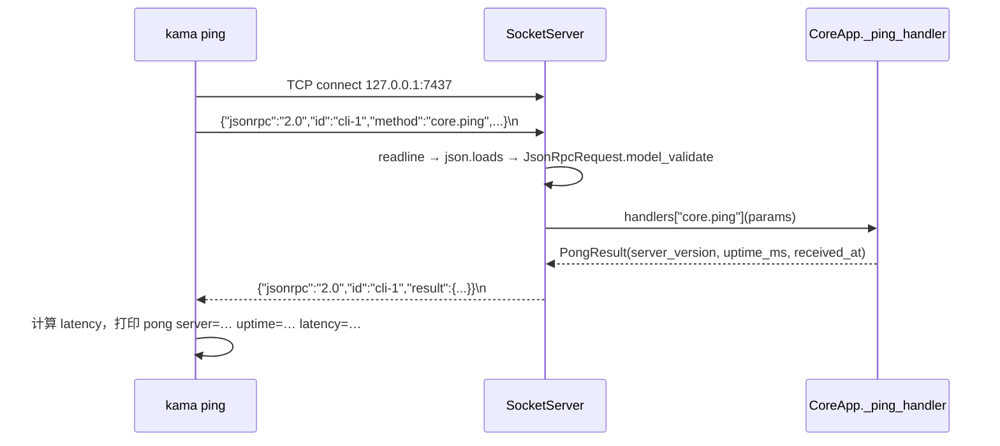

# 01 · S0 骨架与协议契约

> **阶段目标**：CLI 和 daemon 通过真实 IPC 完成一次 ping/pong。
> **对应 commit**：`89e6df4 feat(s0): 完成 S0 阶段——项目骨架与协议契约`（40 个文件，+1465 行）
> **本篇涉及文件**：`core/bus/*`、`core/transport/socket_server.py`、`core/config.py`、`core/logging_setup.py`、`core/app.py`、`cli/main.py`、`cli/commands/ping.py`、`scripts/gen_protocol_doc.py`、`tests/conftest.py`

---

## 1. 这一阶段要解决什么问题

一个“AI Agent 项目”的第一个 commit 居然没有任何 AI——只有一个能回 `pong` 的守护进程。这是刻意的：

- 如果第一版就是“一个 Python 脚本调 LLM”，那么后面想加 TUI、想让任务在后台跑、想让多个前端同时看同一个 Agent，都要推倒重来。
- S0 先把**进程边界**和**协议边界**立住：`kama`（客户端）与 `kama-core`（服务端）是两个进程，通过 TCP 交换“类型化的消息”。之后每个阶段只是在这条管道上**加命令、加事件**。

S0 的产出可以浓缩成三件事：

1. **协议**：JSON-RPC 2.0 + NDJSON，消息全部是 pydantic 模型（`core/bus/`）
2. **传输**：基于 `asyncio.start_server` 的 TCP 服务器（`core/transport/socket_server.py`）
3. **工程底座**：四级配置、结构化日志、自动生成的协议文档、能拉起真实 daemon 的测试 fixture

---

## 2. 前置知识

### 2.1 JSON-RPC 2.0

一个极简的 RPC 规范，只有三种消息：

```jsonc
// 请求
{"jsonrpc": "2.0", "id": "cli-1", "method": "core.ping", "params": {"client": "cli/0.0.1"}}
// 成功响应（id 与请求一致）
{"jsonrpc": "2.0", "id": "cli-1", "result": {"server_version": "0.0.1", "uptime_ms": 12, "received_at": "..."}}
// 错误响应
{"jsonrpc": "2.0", "id": "cli-1", "error": {"code": -32601, "message": "Method not found: core.xxx"}}
```

规范预定义了几个错误码（`-32700` 解析错误、`-32600` 请求非法、`-32601` 方法不存在、`-32602` 参数错误、`-32603` 内部错误），`-32000 ~ -32099` 留给应用自定义。项目后面 S4 的 `SESSION_BUSY = -32012` 就落在这个区间。

### 2.2 NDJSON（Newline-Delimited JSON）

TCP 是字节流，没有“消息”的概念，必须自己**分帧**。常见做法有“长度前缀”和“分隔符”两种。NDJSON 选的是分隔符：**每条消息是一行 JSON，以 `\n` 结尾**。

- 优点：实现极简（`reader.readline()` 就是一次收一帧）；人类可读，用 `nc` 就能手动调试；日志、事件文件（`events.jsonl`）也能用同一格式。
- 约束：JSON 本身不能含裸换行——`json.dumps` 默认会把字符串里的换行转义成 `\n`，所以没问题。

### 2.3 为什么是 TCP 而不是 Unix Socket

CLAUDE.md 里还残留一句“connect over a Unix domain socket”，但实际代码用的是 `127.0.0.1:7437` TCP（`_DEFAULT_PORT = 7437`，[`config.py:12`](../../src/kama_claude/core/config.py#L12)）。TCP 的好处是跨平台（Windows 也能跑）、以后接 Web 前端也方便；代价是本机任何进程都能连上这个端口——项目目前没有鉴权，思考题里会再讨论。

---

## 3. 设计思路与架构图

### 3.1 分层

```
┌──────────────────────── 协议层 core/bus/ ────────────────────────┐
│ envelope.py  JsonRpcRequest / JsonRpcSuccess / JsonRpcError      │  ← “信封”：所有消息的外壳
│ commands.py  PingCommand / PongResult / Command 判别联合         │  ← “信件内容”：每种命令的参数和结果
│ events.py    CoreStartedEvent / Event 判别联合                   │  ← 服务端主动推送的事件（S2 起才真正推送）
└──────────────────────────────────────────────────────────────────┘
┌──────────────────────── 传输层 core/transport/ ──────────────────┐
│ socket_server.py  读一行 → 解析信封 → 按 method 路由到 handler   │
│                   → handler 返回 pydantic 结果 → 包成 Success 写回 │
└──────────────────────────────────────────────────────────────────┘
┌──────────────────────── 应用层 core/app.py ──────────────────────┐
│ CoreApp  加载配置 → 初始化日志 → 创建 SocketServer → 注册 handler │
│          → 等待 SIGINT/SIGTERM → 优雅关闭                          │
└──────────────────────────────────────────────────────────────────┘
```

传输层**不认识任何具体命令**，它只认识“信封”和一张 `method → handler` 的表。新增命令只需：在 `commands.py` 加模型 → 在 `CoreApp` 写 handler → `server.register(...)`。这是后面 S2–S7 不断加命令却几乎不动传输层的原因。

### 3.2 一次 ping 的时序



---

## 4. 关键代码精读

### 4.1 信封：[`core/bus/envelope.py`](../../src/kama_claude/core/bus/envelope.py)

```python
class JsonRpcRequest(BaseModel):
    jsonrpc: Literal["2.0"] = "2.0"          # 版本号只能是 "2.0"，否则校验失败
    id: str                                   # 必填：没有 id 的“通知”本项目不支持
    method: str
    params: dict[str, Any] = Field(default_factory=dict)   # 默认 {}，handler 不必判空
```

- `Literal["2.0"]` 让“版本不对”在校验阶段就被拒绝（对应测试 `test_request_wrong_version_raises`）。
- `Field(default_factory=dict)` 而不是 `= {}`：避免所有实例共享同一个可变默认值。
- `JsonRpcError.id` 允许 `None`（[`envelope.py:34`](../../src/kama_claude/core/bus/envelope.py#L34)）：连 JSON 都解析不了时，根本拿不到请求 id，规范要求返回 `id: null`。

[`envelope.py:45-51`](../../src/kama_claude/core/bus/envelope.py#L45-L51) 的 `HandlerError` 是 S3 才加的：handler 抛它，SocketServer 就返回指定的业务错误码，而不是笼统的 `-32603 Internal error`。

### 4.2 命令模型与判别联合：[`core/bus/commands.py`](../../src/kama_claude/core/bus/commands.py)

S0 时这个文件只有两个类：

```python
class PingCommand(BaseModel):
    type: Literal["core.ping"] = "core.ping"
    client: str

class PongResult(BaseModel):
    server_version: str
    uptime_ms: int
    received_at: str  # ISO 8601

Command = Annotated[PingCommand, Discriminator("type")]
```

每个命令模型都带一个 `type` 字段，值等于 JSON-RPC 的 method 名。当前版本的联合（[`commands.py:104-115`](../../src/kama_claude/core/bus/commands.py#L104-L115)）已经扩展到 9 种命令。

> 细节：实际分发时 SocketServer 是按信封里的 `method` 字符串查表的，handler 内部再用具体模型 `XxxCommand.model_validate(params)` 校验参数——`Command` 联合本身主要用于文档生成和类型约束。

### 4.3 传输层：[`core/transport/socket_server.py`](../../src/kama_claude/core/transport/socket_server.py)

**启动前先探测端口**（[`socket_server.py:68-83`](../../src/kama_claude/core/transport/socket_server.py#L68-L83)）：

```python
async def start(self) -> str:
    try:
        _r, w = await asyncio.open_connection(self._host, self._port)   # 先尝试“连”一下
        w.close(); await w.wait_closed()
        raise SystemExit(f"core already running at {self._host}:{self._port}")
    except (ConnectionRefusedError, OSError):
        pass                                                             # 连不上 = 没人占用
    self._server = await asyncio.start_server(
        self._handle_connection, host=self._host, port=self._port,
        limit=_MAX_LINE_BYTES,                                           # 单行上限 64MB
    )
```

为什么不直接 bind、失败再报错？因为 bind 失败只会得到一个笼统的 `Address already in use`，无法区分“另一个 kama-core 在跑”和“端口被别的程序占了”。探测后能给出更明确的提示。（这仍有竞态，见思考题。）

**每个连接一个读循环**（[`socket_server.py:122-139`](../../src/kama_claude/core/transport/socket_server.py#L122-L139)）：

```python
while True:
    line = await reader.readline()      # 读一帧
    if not line:                         # b"" = 对端关闭
        return
    asyncio.create_task(self._handle_line(line, writer))
```

S0 时最后一行是 `await self._handle_line(line, writer)`——**串行**处理。S5 改成了 `create_task`——**并发**处理。原因要到 S5 才能完全理解（审批命令需要在长命令执行期间被处理），这里先留个印象。

**单行处理 = 一条完整的错误处理链**（[`socket_server.py:142-197`](../../src/kama_claude/core/transport/socket_server.py#L142-L197)）：

| 失败点 | 返回 | 行号 |
|--------|------|------|
| `json.loads` 失败 | `PARSE_ERROR (-32700)`，id=null | L143-147 |
| 信封校验失败（缺 id、版本不对） | `INVALID_REQUEST (-32600)` | L149-153 |
| method 未注册 | `METHOD_NOT_FOUND (-32601)` | L168-174 |
| handler 抛 `HandlerError` | handler 指定的业务码 | L179-181 |
| handler 内参数校验失败（`ValidationError`） | `-32600 "Invalid params"` | L182-187 |
| handler 抛其他异常 | `INTERNAL_ERROR (-32603)` + 记录堆栈 | L188-191 |
| 正常 | `JsonRpcSuccess`，若结果是 BaseModel 先 `model_dump()` | L193-197 |

原则是：**任何一帧坏数据都不能让 daemon 崩溃，也不能让这个连接断掉**。对应集成测试 `test_invalid_json_returns_error`。

> 小瑕疵：参数校验失败按 JSON-RPC 规范应该返回 `INVALID_PARAMS (-32602)`，代码里常量定义了但这里用的是 `INVALID_REQUEST`。

**写回**（[`socket_server.py:200-202`](../../src/kama_claude/core/transport/socket_server.py#L200-L202)）：`writer.write(msg.model_dump_json().encode() + b"\n")` 然后 `await writer.drain()`。后面的 trace 记录是 Trace 阶段加的。

### 4.4 配置：[`core/config.py`](../../src/kama_claude/core/config.py)

[`get_config()`](../../src/kama_claude/core/config.py#L89-L115) 的叠加顺序（后者覆盖前者）：

```
dataclass 默认值
  → ~/.kama/config.toml              （全局）
  → ./.kama/config.toml               （项目本地，S6 加入）
  → KAMA_* 环境变量（其中 .env 里的值也算“环境变量”）
```

实现要点：

1. `load_dotenv(".env", override=False)`（[L93](../../src/kama_claude/core/config.py#L93)）把 `.env` 读进 `os.environ`，但**不覆盖已经存在的系统环境变量**——这就实现了“系统环境变量 > .env”。
2. 必须先加载 `.env`，因为 `.env` 里可能写了 `KAMA_CONFIG`，决定读哪个 TOML（[L92 注释](../../src/kama_claude/core/config.py#L92)）。
3. `_apply_toml` 对未知 key **直接退出**（[L120-122](../../src/kama_claude/core/config.py#L120-L122)）。拼错配置项（如 `prot = 7437`）时宁可启动失败，也不要静默忽略——这是“fail fast”原则。
4. 每个值都做类型检查（`isinstance(val, int)` 等），错误信息指明具体字段。

用 `@dataclass` 而不是 pydantic 做配置对象，是因为配置只在进程内使用，不需要序列化；但也因此需要手写大量校验代码（这个文件 400 行，大部分是校验）。

### 4.5 日志：[`core/logging_setup.py`](../../src/kama_claude/core/logging_setup.py)

- 两种格式：`text`（`level=INFO ts=... source=... msg="..."`，logfmt 风格）和 `json`（给日志聚合系统用）。
- 同时挂 stderr handler 和 `RotatingFileHandler`（10MB × 5 份）。`KAMA_LOG_FILE=""` 时不写文件——测试 fixture 就是这样关掉文件日志的。
- TUI 有自己的日志初始化（[`tui/__main__.py:16-31`](../../src/kama_claude/tui/__main__.py#L16-L31)），**只写文件不写 stderr**，否则日志会把 Textual 的画面打乱。

### 4.6 守护进程入口：[`core/app.py`](../../src/kama_claude/core/app.py)

S0 版的 `CoreApp.run()` 只有 20 行（`git show 89e6df4:src/kama_claude/core/app.py`），骨架至今未变：

```python
async def run(self) -> None:
    config = get_config(); setup_logging(config)
    server = SocketServer(config.host, config.port)
    server.register("core.ping", self._ping_handler)
    addr = await server.start()

    loop = asyncio.get_running_loop()
    shutdown = asyncio.Event()
    loop.add_signal_handler(signal.SIGINT, shutdown.set)    # Ctrl+C
    loop.add_signal_handler(signal.SIGTERM, shutdown.set)   # kill / kama core stop
    await shutdown.wait()                                   # 主协程在这里“睡着”，服务器在后台工作
    await server.stop()
```

`loop.add_signal_handler` 是 asyncio 处理信号的正确方式：信号到来时在事件循环里调用 `shutdown.set`，而不是在任意位置抛 `KeyboardInterrupt`。于是关闭流程是可控的、按顺序的（当前版本在这里依次取消运行中的 run、关闭 MCP、关服务器、刷 trace，见 [`app.py:283-292`](../../src/kama_claude/core/app.py#L283-L292)）。

`_ping_handler`（[`app.py:72-79`](../../src/kama_claude/core/app.py#L72-L79)）用 `time.monotonic()` 计算 uptime——单调时钟不受系统改时间影响，计算时间间隔一定要用它。

### 4.7 客户端：[`cli/commands/ping.py`](../../src/kama_claude/cli/commands/ping.py)

S0 的 ping 是**手写原始 JSON** 发送的（[`ping.py:28-35`](../../src/kama_claude/cli/commands/ping.py#L28-L35)），没有用任何客户端封装——S2 才出现 `SocketClient`。解析响应时先看有没有 `error` 键，再分别用 `JsonRpcError` / `JsonRpcSuccess` + `PongResult` 校验。

`cmd_ping` 把 `ConnectionRefusedError` 翻译成 `error: core not running (127.0.0.1:7437)` 并以退出码 1 结束——CLI 的错误要给人看，不要把堆栈甩给用户。

### 4.8 协议文档生成：[`scripts/gen_protocol_doc.py`](../../scripts/gen_protocol_doc.py)

- `_model_section()` 对每个模型调用 `model_json_schema()`，生成“字段表 + JSON Schema + 示例”的 Markdown 小节。
- `--check` 模式（[`main()`](../../scripts/gen_protocol_doc.py)）：重新生成一遍，和磁盘上的 `WIRE_PROTOCOL.md` 逐字比较，不一致就退出码 1。放进 CI（`make verify-s0`）后，**改了模型忘了更新文档，CI 就红**。

这就是 README 里说的“协议契约”：文档不是人写的，是从代码生成的，不可能过期。

> 需要注意：脚本里要显式 import 并列出每个模型。当前版本的脚本没有列出 S5–S7 新增的 `PermissionRespondCommand`、`SessionCompactCommand`、`Permission*Event`、`Subagent*Event` 等模型，所以 `WIRE_PROTOCOL.md` 并不完整——“生成式文档”也需要有人维护生成脚本的覆盖面。

---

## 5. 测试解读

### 5.1 fixture：拉起一个真实 daemon —— [`tests/conftest.py`](../../tests/conftest.py)

```python
@pytest.fixture
def free_port() -> int:
    with socket.socket(socket.AF_INET, socket.SOCK_STREAM) as s:
        s.bind(("127.0.0.1", 0))           # 端口 0 = 让操作系统分配一个空闲端口
        port = s.getsockname()[1]
    return port                             # socket 关闭，端口释放给 daemon 用

@pytest.fixture
async def running_daemon(free_port):
    env = {**os.environ, "KAMA_PORT": str(free_port), "KAMA_LOG_FILE": "", "KAMA_LOG_LEVEL": "WARNING"}
    proc = subprocess.Popen([sys.executable, "-m", "kama_claude.core"], env=env)
    # 每 50ms 尝试连一次，3 秒内连上即认为就绪
    ...
    yield proc
    proc.terminate(); proc.wait(timeout=2)  # 超时则 kill
```

要点：

- **随机端口**：测试可以并行跑，也不会和你本机正在运行的 daemon 冲突。
- **通过环境变量注入配置**：正好复用了四级配置的最高优先级。
- **轮询就绪而不是 `sleep(1)`**：更快也更稳。
- `pytest-asyncio` 的 `asyncio_mode = "auto"`（[`pyproject.toml:64`](../../pyproject.toml#L64)）让 `async def` 测试和 fixture 不需要加装饰器。

### 5.2 集成测试：[`tests/integration/test_ping_roundtrip.py`](../../tests/integration/test_ping_roundtrip.py)

三个测试都**直接写原始字节**，不经过任何客户端封装：

| 测试 | 验证 |
|------|------|
| `test_ping_returns_pong` | 正常路径，检查 `jsonrpc`、`id` 回显、`result` 字段 |
| `test_unknown_method_returns_error` | 精确断言 `-32601` |
| `test_invalid_json_returns_error` | 发送 `b"not valid json\n"`，断言 `-32700` 且 daemon 不崩 |

设计行写着“直接验证 wire 协议的端到端正确性”——如果测试用的是项目自己的客户端，那么客户端和服务端同时写错（比如都把 `id` 拼成 `Id`）时测试也会通过。**协议测试要用“最笨的客户端”**。

### 5.3 单元测试

- [`test_envelope.py`](../../tests/unit/test_envelope.py)：JSON 往返、默认值、缺字段、版本不对、`id=None`。
- [`test_commands_events.py`](../../tests/unit/test_commands_events.py)：命令/事件模型的往返与 `type` 默认值。
- [`test_config_env.py`](../../tests/unit/test_config_env.py)：用 `monkeypatch.chdir(tmp_path)` + 临时 `.env` 验证优先级链。注意 `monkeypatch.delenv(..., raising=False)`：先清掉系统里可能存在的同名变量，测试才不受运行环境影响。

```bash
uv run pytest tests/unit/test_envelope.py tests/unit/test_commands_events.py tests/unit/test_config_env.py -v
ANTHROPIC_API_KEY=dummy uv run pytest tests/integration/test_ping_roundtrip.py -v
```

---

## 6. 动手练习

1. **手动说协议**：daemon 运行时，
   ```bash
   printf '{"jsonrpc":"2.0","id":"1","method":"core.ping","params":{"client":"nc"}}\n' | nc -q1 127.0.0.1 7437
   printf 'hello\n' | nc -q1 127.0.0.1 7437
   printf '{"jsonrpc":"1.0","id":"1","method":"core.ping"}\n' | nc -q1 127.0.0.1 7437
   ```
   观察三种响应分别对应 4.3 节表格的哪一行。
2. **一个连接多个请求**：用 `nc 127.0.0.1 7437` 进入交互模式，连续粘贴两行 ping（不同 id），观察响应的 id。
3. **配置优先级**：在 `.env` 写 `KAMA_PORT=9001`，再 `KAMA_PORT=9002 uv run kama-core`，看日志里实际监听哪个端口；再建一个 `./.kama/config.toml` 写 `[core]\nprot = 1`，看启动报什么错。
4. **加一个命令（推荐必做）**：实现 `core.echo`：
   - 在 `commands.py` 加 `EchoCommand(type="core.echo", text: str)` 和 `EchoResult(text: str)`；
   - 在 `CoreApp` 加 `_echo_handler`，用 `EchoCommand.model_validate(params)` 校验后原样返回；
   - `server.register("core.echo", ...)`；
   - 在 `test_ping_roundtrip.py` 仿写一个原始字节的集成测试；
   - 把模型加进 `gen_protocol_doc.py` 并运行 `--check` 看它如何失败，再重新生成。
5. **协议文档**：运行 `uv run python scripts/gen_protocol_doc.py --check`，看看当前是否与代码同步。

---

## 7. 思考题

**Q1. 为什么 S0 就要拆成双进程？一个脚本直接调 LLM 不是更快吗？**

<details><summary>参考答案</summary>

短期更快，长期更慢。Agent 的任务可能跑几分钟甚至更久，需要：前端崩了任务不死、多个前端看同一个任务、任务过程可订阅/回放、审批请求能推到前端。这些都要求“执行”和“展示”在不同进程，中间有一个协议。S0 先付出拆分成本，S2 之后的每个功能都是在管道上加命令/事件，不需要重构。
</details>

**Q2. `start()` 先探测再 bind，存在什么竞态？**

<details><summary>参考答案</summary>

两个 kama-core 几乎同时启动时，两者探测都连不上，于是都去 bind；后到的那个 `start_server` 会抛 `OSError: Address already in use`（而不是友好的 “core already running”）。探测只是为了在常见情况下给出更好的提示，真正的“互斥”仍靠操作系统的 bind 语义。更严格的做法是 PID 文件 + 文件锁（`kama core start` 写了 PID 文件，但 daemon 自己没有加锁）。
</details>

**Q3. 为什么选“分隔符分帧”而不是“长度前缀分帧”？各有什么代价？**

<details><summary>参考答案</summary>

分隔符（NDJSON）：实现简单、可读、能用 `nc` 调试、和 `.jsonl` 日志同构；代价是消息体不能含裸分隔符（JSON 已保证），以及必须设置单行上限防止恶意超长行耗尽内存（`limit=_MAX_LINE_BYTES`）。长度前缀：可以传任意二进制、预先知道要读多少字节；代价是不可读，调试需要专门工具。对“本机、文本协议、需要可观测”的场景，NDJSON 更合适。
</details>

**Q4. daemon 监听 `127.0.0.1:7437` 且没有鉴权，本机其他用户或进程能做什么？**

<details><summary>参考答案</summary>

任何能连上本机回环地址的进程都能发 `session.send_message` 让 Agent 执行任务、发 `permission.respond` 替你批准 bash 命令。在单人开发机上风险可控；多用户机器或者浏览器环境（网页 JS 不能直接发裸 TCP，但要警惕以后加 HTTP/WebSocket 前端时的 DNS rebinding 等问题）就需要：Unix domain socket + 文件权限，或者启动时生成随机 token 写入 `~/.kama/`（权限 600），客户端连接后先认证。
</details>

**Q5. 参数校验失败返回 `-32600` 而不是 `-32602`，会造成什么影响？怎么改？**

<details><summary>参考答案</summary>

客户端无法区分“信封本身不合法”和“信封合法但参数不对”，不利于调试和做差异化提示。修改 `socket_server.py` 中 `except ValidationError` 分支，使用已定义的 `INVALID_PARAMS` 常量即可，并补一个集成测试（例如对 `agent.run` 不传 `goal`）。
</details>
