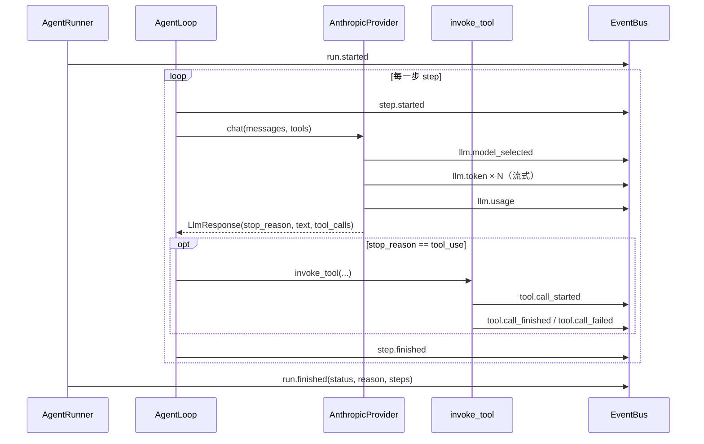

# 02 · S1 Agent 最小闭环

> **阶段目标**：一次 `kama run --goal "..."` 从 goal 到 LLM、工具、事件文件完整跑通。
> **对应 commit**：`76e2992 feat(s1): 实现 Core 最小闭环——单进程 Agent 循环`（36 文件，+2950 行）
> **本篇涉及文件**：`core/context.py`、`core/loop.py`、`core/runner.py`、`core/llm/*`、`core/tools/*`、`core/events/*`、`core/bus/events.py`、`cli/commands/run.py`

---

## 1. 这一阶段要解决什么问题

S0 的管道里还没有“Agent”。S1 要回答那个最核心的问题：**所谓 AI Agent，到底是怎么跑起来的？**

答案出奇地短——就是一个 `while` 循环：

```
messages = [用户目标]
while 没结束:
    response = LLM(messages, 可用工具列表)          # plan：模型决定下一步
    messages.append(response)                       # observe：把模型输出记进历史
    if 模型要调用工具:
        for 每个工具调用:
            result = 执行工具(...)                   # act：真正干活
            messages.append(工具结果)                 # 把结果喂回去
    elif 模型说完了:
        结束
```

S1 把这个循环实现成四个清晰分工的组件，并且从第一天起就让**每一步都发布事件**、**事件都落盘**：

| 组件 | 文件 | 职责 |
|------|------|------|
| `ExecutionContext` | `core/context.py` | 一次 run 的“状态”：消息历史、步数、结果 |
| `AgentLoop` | `core/loop.py` | 驱动 plan → act → observe 循环 |
| `LLMProvider` / `AnthropicProvider` | `core/llm/` | 调模型：流式输出、解析工具调用 |
| `ToolRegistry` / `invoke_tool` / `BaseTool` | `core/tools/` | 工具的注册、校验、限时执行 |
| `EventBus` / `EventWriter` | `core/events/` | 发布事件 / 事件写入 `events.jsonl` |
| `AgentRunner` | `core/runner.py` | 为一次 run 把上面这些“接线”起来 |

注意：S1 仍是**单进程**——`kama run` 在 CLI 进程里直接 new 一个 `AgentRunner` 跑，还没走 S0 的 IPC。S2 才把它搬进 daemon。

---

## 2. 前置知识：Anthropic Messages API 的工具调用协议

读懂 `loop.py` 和 `context.py` 必须先懂这套消息格式。

### 2.1 消息结构

```jsonc
[
  {"role": "user", "content": "读一下 sample.txt，告诉我魔法数字"},
  {"role": "assistant", "content": [
      {"type": "text", "text": "我来读取文件。"},
      {"type": "tool_use", "id": "toolu_01", "name": "read_file", "input": {"path": "sample.txt"}}
  ]},
  {"role": "user", "content": [
      {"type": "tool_result", "tool_use_id": "toolu_01", "content": "The magic number is 7391."}
  ]},
  {"role": "assistant", "content": [{"type": "text", "text": "魔法数字是 7391。"}]}
]
```

三条硬规则（违反就是 400 `invalid_request_error`）：

1. **user / assistant 交替**。
2. **工具结果放在 `role: user` 的消息里**，类型是 `tool_result`，用 `tool_use_id` 对应上一条 assistant 里的 `tool_use.id`。
3. **一轮里的多个 tool_use，其所有 tool_result 必须放在紧随其后的同一条 user 消息里**，每个 tool_use 都要有结果。

### 2.2 stop_reason

模型每次返回都带 `stop_reason`：

| 值 | 含义 | loop 怎么处理 |
|----|------|---------------|
| `end_turn` | 模型认为说完了 | 标记成功，结束 |
| `tool_use` | 模型要调用工具 | 执行工具，结果喂回，继续 |
| `max_tokens` | 输出被 `max_tokens` 截断 | S1 没处理；后来补了“截断在工具调用中间”的情况 |

### 2.3 工具定义

请求里 `tools` 是一个 JSON Schema 列表：`{"name", "description", "input_schema"}`。模型根据 `description` 决定何时用、根据 `input_schema` 生成参数。**工具描述写得好不好，直接决定 Agent 聪不聪明**——看看 `ReadFileTool.description` 如何交代“路径必须相对”“超 512KB 截断”。

---

## 3. 设计思路与架构图

### 3.1 组件关系

```
cmd_run (CLI)
  └─ AgentRunner(config, extra_handlers=[StdoutPrinter.handle])
        │ run(goal)
        ├─ new_run_id()  → runs/<run_id>/
        ├─ EventBus()  ← subscribe: StdoutPrinter.handle, EventWriter.handle
        ├─ AnthropicProvider(model)
        ├─ ToolRegistry  ← register(ReadFileTool())
        ├─ ExecutionContext(run_id, goal, max_steps)
        └─ AgentLoop(provider, registry, bus).run(context)
                ├─ provider.chat(messages, tool_schemas, bus, run_id)
                │     └─ publish: llm.model_selected / llm.token×N / llm.usage
                └─ invoke_tool(registry, tool_call, bus, run_id)
                      └─ publish: tool.call_started / tool.call_finished|failed
```

### 3.2 一次 run 的事件序列



**events.jsonl 的第一行一定是 `run.started`，最后一行一定是 `run.finished`**——无论成功、失败还是被取消。这是 S1 的核心验收标准（`test_events_jsonl_created_with_started_and_finished`）。

---

## 4. 关键代码精读

### 4.1 ExecutionContext：[`core/context.py`](../../src/kama_claude/core/context.py)

```python
@dataclass
class ExecutionContext:
    run_id: str
    goal: str
    max_steps: int
    messages: list[dict[str, Any]] = field(default_factory=list)
    step: int = 0
    status: str = "running"   # "running" | "success" | "failed"
    reason: str | None = None
    result: str = ""          # S3 加入：最终回答文本
```

（`prefill_messages` / `session_notes` / `global_context` / `system_prompt_override` 等字段是 S4、S6、S7 加的，先忽略。）

**`add_tool_result` 是整个文件最关键的方法**（[`context.py:51-72`](../../src/kama_claude/core/context.py#L51-L72)）：

```python
last = self.messages[-1] if self.messages else None
if (last is not None and last["role"] == "user"
        and isinstance(last["content"], list) and last["content"]
        and all(b.get("type") == "tool_result" for b in last["content"])):
    last["content"].append(block)                       # 合并进同一条 user 消息
else:
    self.messages.append({"role": "user", "content": [block]})
```

这就是 2.1 节规则 3 的实现：同一步的多个工具结果合并到一条 user 消息。调用方（loop）不用关心合并逻辑，只管 `add_tool_result` 即可。

状态机很简单：`running → success | failed`，`is_done()` 就是 `status != "running"`。

### 4.2 AgentLoop：[`core/loop.py`](../../src/kama_claude/core/loop.py)

当前版本 [`loop.py:48-132`](../../src/kama_claude/core/loop.py#L48-L132)，去掉后续阶段的附加逻辑后，S1 的主干是：

```python
async def run(self, context: ExecutionContext) -> None:
    while not context.is_done():
        context.step += 1
        await self._bus.publish(StepStartedEvent(...))

        # [plan] 调 LLM —— API 错误直接终止 run
        try:
            response = await self._provider.chat(
                messages=context.messages,
                tool_schemas=self._registry.tool_schemas(),
                bus=self._bus, run_id=context.run_id, ...)
        except asyncio.CancelledError:
            context.mark_failed("cancelled")
            raise                                 # ① 取消必须继续向上抛
        except Exception:
            context.mark_failed("llm_error")
            break

        # [observe] 把 assistant 输出（文本 + tool_use 块）追加进历史
        blocks = []
        if response.text:
            blocks.append({"type": "text", "text": response.text})
        for tc in response.tool_calls:
            blocks.append({"type": "tool_use", "id": tc.id, "name": tc.name, "input": tc.input})
        context.add_assistant_message(blocks)

        # [act] 执行工具；工具失败也变成 tool_result，循环继续   ② 错误即数据
        if response.stop_reason == "tool_use":
            for tc in response.tool_calls:
                result = await invoke_tool(self._registry, tc, self._bus, context.run_id)
                context.add_tool_result(tc.id, result.content, is_error=result.is_error)

        # 终止判断 —— 同一步既 end_turn 又到 max_steps，以 end_turn 为准   ③
        if response.stop_reason == "end_turn":
            context.result = response.text or ""
            context.mark_success()
        elif context.step >= context.max_steps:
            context.mark_failed("exceeded_max_steps")

        await self._bus.publish(StepFinishedEvent(...))
```

三个值得记住的设计：

1. **CancelledError 与普通异常区别对待**：普通异常 = LLM 出错，标记失败后正常退出循环；取消 = 外部要求停止，必须 `raise` 让调用方知道。
2. **工具错误是“数据”而不是“异常”**：`invoke_tool` 永远返回 `ToolResult`，失败时 `is_error=True`。模型在下一步看到 `"is_error": true` 的 tool_result，会自己换个办法（比如文件不存在就先 `list_dir`）。这是 Agent 鲁棒性的来源——**让模型处理错误，而不是让程序崩溃**。
3. **max_steps 是安全阀**：模型可能陷入“一直调工具”的循环，必须有上限（默认 20，`KAMA_MAX_STEPS` 可调）。

当前版本在此基础上多了几处（后续阶段会讲）：

- [L63-68](../../src/kama_claude/core/loop.py#L63-L68) 传入 `system=context.system_prompt(...)`（S4/S6 记忆注入）
- [L82](../../src/kama_claude/core/loop.py#L82) 先放 `thinking_blocks`（S7 后续：extended thinking 块必须原样回传）
- [L94-98](../../src/kama_claude/core/loop.py#L94-L98) `invoke_tool` 多了 `permission_manager`（S5）
- [L100-109](../../src/kama_claude/core/loop.py#L100-L109) `max_tokens` 截断在工具调用中间时，补上合成的错误 tool_result，保证 tool_use/tool_result 配平
- [L120-128](../../src/kama_claude/core/loop.py#L120-L128) 上下文水位过高时自动压缩（S6）

### 4.3 LLMProvider 协议与 AnthropicProvider

**接口**（[`core/llm/base.py`](../../src/kama_claude/core/llm/base.py)）用的是 `typing.Protocol`（结构化子类型）：任何有同签名 `chat()` 方法的对象都算 `LLMProvider`，不需要继承。测试里的 `_MockProvider`、Trace 阶段的 `TracingProvider` 都是这样“冒充”的。

**返回值**（[`core/llm/types.py`](../../src/kama_claude/core/llm/types.py)）是项目自己的 dataclass：`LlmResponse(stop_reason, tool_calls, text, usage)`。把 SDK 的对象转换成自己的类型，loop 就不依赖 anthropic SDK——换模型供应商只需要再写一个 provider。

**实现**（[`core/llm/provider.py:58-165`](../../src/kama_claude/core/llm/provider.py#L58-L165)）按顺序做了这些事：

1. 发布 `llm.model_selected`（[L68-70](../../src/kama_claude/core/llm/provider.py#L68-L70)）。
2. **Prompt caching**（[L72-84](../../src/kama_claude/core/llm/provider.py#L72-L84)）：给 system prompt 块和**最后一个**工具定义加上 `cache_control: {"type": "ephemeral"}`。Anthropic 会缓存“到这个标记为止的前缀”，后续请求前缀相同就按缓存读取计费（更便宜、更快）。Agent 每一步都会重发同样的 system + tools，缓存收益很大。
3. **流式调用**（[L101-107](../../src/kama_claude/core/llm/provider.py#L101-L107)）：
   ```python
   async with self._client.messages.stream(**kwargs) as stream:
       async for text in stream.text_stream:       # 每来一小段文本就 yield 一次
           await bus.publish(LlmTokenEvent(run_id=run_id, token=text, ts=_now()))
           text_parts.append(text)
       final_message = await stream.get_final_message()   # 流结束后拿完整消息（含 tool_use 块）
   ```
   `async for` 是“异步迭代”：每次取下一个元素都可能要等网络，等的时候事件循环去做别的事。token 事件就是 TUI “打字机效果”的来源。
4. 发布 `llm.usage`（输入/输出 token、缓存命中数）。
5. 解析 `final_message.content`，把 `tool_use` 块转成 `ToolCallBlock`（[L144-151](../../src/kama_claude/core/llm/provider.py#L144-L151)）。

`__init__` 里缺 API key 直接 `SystemExit`（[L49-51](../../src/kama_claude/core/llm/provider.py#L49-L51)）：测试 `test_missing_api_key_raises_system_exit` 的设计行解释了原因——fail fast，防止出现“有 started 没有 finished 的幽灵 run”。

### 4.4 工具体系：[`core/tools/`](../../src/kama_claude/core/tools/)

**基类**（[`base.py`](../../src/kama_claude/core/tools/base.py)）：

```python
@dataclass
class ToolResult:
    content: str
    is_error: bool = False
    error_type: str | None = None     # "runtime_error" | "timeout" | "schema_error" | ...

class BaseTool(ABC):
    name: str
    description: str
    input_schema: dict[str, object]
    params_model: ClassVar[type[BaseModel] | None] = None   # S5 加入
    @abstractmethod
    async def invoke(self, params: dict[str, object]) -> ToolResult: ...
```

**注册表**（[`registry.py`](../../src/kama_claude/core/tools/registry.py)）就是一个 `name → tool` 的字典，`tool_schemas()` 生成发给 LLM 的工具列表。

**第一个工具**（[`builtin/read_file.py`](../../src/kama_claude/core/tools/builtin/read_file.py)）：读文件、超过 512KB 截断、拒绝含 `..` 的路径。注意它**直接抛异常**（`PermissionError`、`FileNotFoundError`）——异常由 `invoke_tool` 统一兜底转成 `ToolResult(is_error=True)`，工具作者不用每个都 try/except。

**统一调用入口 `invoke_tool`**：S1 版（`git show 76e2992:src/kama_claude/core/tools/invocation.py`）的流程：

```
publish tool.call_started
  → 工具不存在？          → _fail("runtime_error", "unknown tool: xxx")
  → 缺 required 参数？    → _fail("schema_error", "missing required parameters: ...")
  → asyncio.wait_for(tool.invoke(...), timeout=120)
       ├─ 返回 is_error    → _fail(result.error_type)
       ├─ 成功             → publish tool.call_finished, return result
       ├─ TimeoutError     → _fail("timeout")
       └─ 其他异常         → _fail("runtime_error", str(exc))
```

`_fail()` 同时做两件事：发布 `tool.call_failed` 事件（给人看）+ 返回 `ToolResult(is_error=True)`（给模型看）。**同一个失败，对人和对模型各有一个出口。**

当前版本（[`invocation.py:64-209`](../../src/kama_claude/core/tools/invocation.py#L64-L209)）在此基础上加了 pydantic 参数校验、权限审批、重试（S5 讲）。

### 4.5 事件：EventBus 与 EventWriter

**EventBus**（[`events/bus.py`](../../src/kama_claude/core/events/bus.py)）只有 20 行：

```python
async def publish(self, event: BaseModel) -> None:
    for handler in self._subscribers:
        await handler(event)            # 按注册顺序，逐个 await
```

极简的同步扇出：发布者会**等所有订阅者处理完**才继续。好处是事件顺序严格、简单可靠；代价见思考题 Q3。

**EventWriter**（[`events/writer.py`](../../src/kama_claude/core/events/writer.py)）是一个异步上下文管理器（`async with`）：进入时以追加模式打开 `events.jsonl`，每个事件写一行并 `flush()`，写失败只记日志不抛异常（[L32-39](../../src/kama_claude/core/events/writer.py#L32-L39)）——**观测系统的故障不能拖垮被观测的系统**。

**事件模型**（[`bus/events.py`](../../src/kama_claude/core/bus/events.py)）：S1 一次性加了 `run.*`、`step.*`、`tool.*`、`llm.*`、`log.line`。命名规则是 `领域.动作`，这让 S2 可以用 `fnmatch` 通配符订阅（`"tool.*"`）。

### 4.6 AgentRunner：[`core/runner.py`](../../src/kama_claude/core/runner.py)

S1 版完整代码只有 80 行（`git show 76e2992:src/kama_claude/core/runner.py`），核心：

```python
async def run(self, goal: str) -> None:
    run_id = new_run_id()                               # 20260516-100000-abc123
    run_path = self._runs_dir / run_id
    bus = EventBus()
    for h in self._extra_handlers: bus.subscribe(h)     # 外部观察者（CLI 打印器、测试收集器）
    provider = self._provider or AnthropicProvider(self._config.llm.default_model)
    registry = ToolRegistry(); registry.register(ReadFileTool())
    loop = AgentLoop(provider, registry, bus)
    context = ExecutionContext(run_id=run_id, goal=goal, max_steps=self._config.agent.max_steps)

    async with EventWriter(run_path / "events.jsonl") as writer:
        writer.subscribe(bus)
        await bus.publish(RunStartedEvent(...))
        cancelled = False
        try:
            await loop.run(context)
        except asyncio.CancelledError:
            cancelled = True
            if not context.is_done(): context.mark_failed("cancelled")
        await bus.publish(RunFinishedEvent(...))        # ← 无论如何都会发布
    if cancelled:
        raise asyncio.CancelledError()                  # 文件关闭后再把取消抛出去
```

这里有一个很精致的处理：捕获 `CancelledError` → 先把 `run.finished` 写进文件 → 退出 `async with` 关文件 → **再重新抛出** `CancelledError`。既保证了“最后一行一定是 run.finished”，又没有吞掉取消信号。

`provider` 和 `extra_handlers` 可以注入，是为了**可测试性**：单元测试注入 mock provider，不调真实 API；注入事件收集器，不用去读文件就能断言事件。

### 4.7 CLI：StdoutPrinter

S1 版 `cli/commands/run.py` 里的 `StdoutPrinter.handle` 直接接收 pydantic 事件对象，用 `isinstance` 分发打印。它唯一的“状态”是 `_inline`：流式 token 不换行打印，下一个非 token 事件到来前先补一个换行（`_ensure_newline`）。S2 之后它改为接收 dict（因为事件是从网络来的 JSON），见 [`cli/commands/run.py:13-62`](../../src/kama_claude/cli/commands/run.py#L13-L62)。

---

## 5. 测试解读

S1 的测试是全项目最值得学习的一组，核心手法是**用假 provider 驱动真 loop**。

### 5.1 [`tests/unit/test_loop.py`](../../tests/unit/test_loop.py)

```python
class _MockProvider:
    def __init__(self, responses, exc=None):
        self._responses = iter(responses)      # 预先编排好每一步的“模型回复”
    async def chat(self, messages, tool_schemas, bus, run_id, *, step=0, system=None):
        if self._exc is not None: raise self._exc
        return next(self._responses)
```

- `test_end_turn_marks_success`：一步 end_turn → success，step == 1。
- `test_max_steps_marks_failed`：provider 永远返回 tool_use（调一个不存在的工具）+ `max_steps=2` → failed / exceeded_max_steps / step == 2。
- 还有：工具失败后循环继续且 tool_result 带 `is_error`（`test_tool_failure_*`）、CancelledError 标记失败并重新抛出（`test_cancelled_error_marks_failed_and_reraises`）、LLM 异常标记 `llm_error`、step 事件成对发布等。

有了 `LLMProvider` 这个 Protocol 边界，**Agent 的控制流可以 100% 离线、确定性地测试**。

### 5.2 其他

| 文件 | 看点 |
|------|------|
| [`test_context.py`](../../tests/unit/test_context.py) | `test_multiple_tool_results_share_one_message`：消息总数为 3（goal + assistant + 合并后的 user） |
| [`test_llm_provider.py`](../../tests/unit/test_llm_provider.py) | 用 `FakeStream` 模拟 SDK 的流；断言事件顺序 `model_selected → token×N → usage` |
| [`test_event_bus.py`](../../tests/unit/test_event_bus.py) | 断言 `is` 而不是 `==`：确认订阅者拿到的就是同一个对象，没经过序列化 |
| [`test_event_writer.py`](../../tests/unit/test_event_writer.py) | 手动关闭文件句柄制造 OSError，用 `caplog` 断言只记日志不抛异常 |
| [`test_runner.py`](../../tests/unit/test_runner.py) | events.jsonl 首行 run.started / 末行 run.finished；`max_steps` 配置传递 |
| [`test_invocation.py`](../../tests/unit/test_invocation.py) | 未知工具、缺参数、超时、异常四条失败路径 |
| [`test_run_e2e.py`](../../tests/integration/test_run_e2e.py) | 真实 API：文件里藏一个数字 7391，断言 Agent 真的读了文件 |

```bash
uv run pytest tests/unit/test_loop.py tests/unit/test_context.py tests/unit/test_invocation.py -v
```

---

## 6. 动手练习

1. **看一次真实的 run**：配置好 API key，启动 daemon，执行 `uv run kama run --goal "读取 README.md，用一句话总结这个项目"`。然后找到本次 run 的 `events.jsonl`（`ls -t ~/.kama/sessions/*/runs/*/events.jsonl | head -1`），用 `jq -c '{type, step, tool_name}'` 看事件序列，和 3.2 节的时序图对照。
2. **手工走一遍 loop**：在 Python REPL 里
   ```python
   import asyncio
   from kama_claude.core.context import ExecutionContext
   from kama_claude.core.events.bus import EventBus
   from kama_claude.core.llm.types import LlmResponse, ToolCallBlock
   from kama_claude.core.loop import AgentLoop
   from kama_claude.core.tools.registry import ToolRegistry
   from kama_claude.core.tools.builtin import ReadFileTool

   class P:
       def __init__(self): self.n = 0
       async def chat(self, messages, tool_schemas, bus, run_id, *, step=0, system=None):
           self.n += 1
           if self.n == 1:
               return LlmResponse("tool_use", [ToolCallBlock("t1", "read_file", {"path": "pyproject.toml"})])
           return LlmResponse("end_turn", text="done")

   reg = ToolRegistry(); reg.register(ReadFileTool())
   ctx = ExecutionContext(run_id="r", goal="g", max_steps=5)
   asyncio.run(AgentLoop(P(), reg, EventBus()).run(ctx))
   for m in ctx.messages: print(m["role"], str(m["content"])[:80])
   ```
   观察 messages 的四条消息，和 2.1 节格式对照。（当前版本 `invoke_tool` 不传 permission_manager 时不做审批，所以能直接跑。）
3. **写一个新工具**：实现 `word_count` 工具（参数 `path`，返回行数/词数），注册进 `AgentRunner._build_registry`，让 Agent 用它统计 README.md。思考：它应该有 `params_model` 吗？（提示：S5 之后 `invoke_tool` 用它做校验。）
4. **给 loop 加一个单测**：provider 第一步同时返回两个 tool_use（一个成功、一个调用不存在的工具），断言第三条消息里有两个 tool_result，且其中一个 `is_error=True`。

---

## 7. 思考题

**Q1. 为什么工具失败要变成 tool_result 返回给模型，而不是让 run 失败？**

<details><summary>参考答案</summary>

因为大部分工具失败是“可恢复的”：文件路径写错、命令参数不对、目标不存在。模型看到错误信息后通常能自己纠正（换路径、先 list_dir、改命令）。如果直接让 run 失败，Agent 会变得极其脆弱。只有“模型本身调用失败”（llm_error）才是不可恢复的，loop 在那里才终止。
</details>

**Q2. 如果模型返回 `stop_reason == "max_tokens"` 但没有工具调用，当前 loop 会怎样？其他 stop_reason（如 `stop_sequence`、`refusal`）呢？**

<details><summary>参考答案</summary>

既不是 `tool_use` 也不是 `end_turn`，所以既不执行工具也不标记成功；只要没到 max_steps 就进入下一步。此时 messages 的最后一条是 assistant——在 Anthropic API 里这会被当作“预填充（prefill）”，模型会接着这段被截断的文本继续写，某种意义上恰好实现了“续写”。但这是隐式行为：TUI 上会看到一个新 step，`context.result` 只保存最后一段文本，前半段丢失。其他非预期 stop_reason 也会走同样的“再来一步”路径，直到 max_steps。更稳妥的做法是显式处理每种 stop_reason（例如 max_tokens 时拼接文本续写；refusal 时直接结束并标记原因）。
</details>

**Q3. `EventBus.publish` 是逐个 `await` 订阅者的。如果某个订阅者很慢会发生什么？**

<details><summary>参考答案</summary>

发布者（AgentLoop / provider）会被拖慢。比如 S2 之后 `IpcEventBroadcaster.handle` 对每个客户端 `await writer.drain()`，如果某个客户端网络很慢、接收缓冲区满，`drain()` 会一直等，**整个 Agent 的每个 token 都要等它**。常见改进：给每个订阅者一个有界队列 + 独立消费 task（慢消费者只影响自己，满了就丢弃或断开）；或者对慢客户端设置写超时。这里的取舍是：同步扇出保证顺序、实现简单；异步扇出吞吐高、但要处理队列满和顺序问题。
</details>

**Q4. 为什么 `LLMProvider` 用 `Protocol` 而不是抽象基类？**

<details><summary>参考答案</summary>

Protocol 是结构化类型：只要“长得像”就行，不需要显式继承。测试 mock、TracingProvider 这类包装器都不必继承任何东西，mypy 依然能检查签名是否匹配。工具用 ABC（`BaseTool`）是因为工具需要共享类属性（`params_model` 默认值）并强制实现 `invoke`。两者都合理，选择取决于“是否需要共享实现”。
</details>

**Q5. prompt caching 为什么把 `cache_control` 放在最后一个工具上，而不是每个工具上？**

<details><summary>参考答案</summary>

`cache_control` 标记的是“缓存断点”：缓存的是从请求开头到这个断点的整个前缀（tools → system → messages 的顺序）。放在最后一个工具上就覆盖了全部工具定义；每个都放没有额外收益，而且断点数量有上限（Anthropic 限制每个请求最多 4 个）。另外注意：只有前缀**完全相同**才会命中，所以工具列表的顺序必须稳定——`ToolRegistry` 用 dict 保持插入顺序，每次 run 都以同样顺序注册，保证了这一点。
</details>
