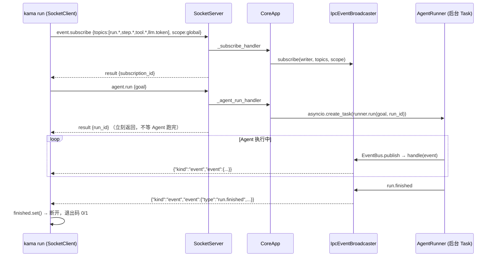

# 03 · S2 事件流外化

> **阶段目标**：AgentRunner 搬进 daemon，CLI/TUI 通过 IPC 订阅同一份事件流。
> **对应 commit**：`1d4d6ba feat(s2): 双进程架构——守护进程 + 客户端通过 TCP NDJSON 通信`（36 文件，+1929 行）
> **本篇涉及文件**：`core/app.py`、`core/transport/ipc_broadcaster.py`、`core/transport/socket_client.py`、`core/transport/socket_server.py`、`core/bus/envelope.py`（`EventPushEnvelope`）、`core/runner.py`、`cli/commands/run.py`、`cli/commands/core.py`、`tui/app.py`（第一版）

---

## 1. 这一阶段要解决什么问题

S1 的 Agent 跑在 CLI 进程里：CLI 退出，Agent 就死了；想同时在 TUI 里看进度，做不到。S2 把 S0 的“管道”和 S1 的“引擎”接起来：

```
S1:  kama run ──(进程内函数调用)──► AgentRunner ──► EventBus ──► StdoutPrinter
S2:  kama run ──(TCP)──► kama-core: AgentRunner ──► EventBus ──► IpcEventBroadcaster ──(TCP 推送)──► kama run / kama-tui
```

这里出现了 S0 没有的通信模式：**服务端主动推送（server push）**。JSON-RPC 本身是“一问一答”，S2 在同一条连接上加了第二种消息：

```jsonc
{"kind": "event", "event": {"type": "tool.call_started", "run_id": "...", ...}}
```

于是一条连接上可能交错出现“对我请求的响应”和“服务端推来的事件”，客户端必须能区分并各自处理。

---

## 2. 前置知识

### 2.1 发布/订阅（Pub/Sub）与两级总线

项目有**两级**发布/订阅：

| 层级 | 组件 | 订阅粒度 | 传输 |
|------|------|----------|------|
| 进程内 | `EventBus` | 订阅“所有事件” | 函数调用 |
| 进程间 | `IpcEventBroadcaster` | 按 **topic 通配符** + **scope（全局 / 某个 run）** 过滤 | TCP 写 |

`IpcEventBroadcaster` 本身就是 `EventBus` 的一个订阅者——它把“进程内事件”翻译成“网络推送”。这是一种很常见的**桥接（bridge）**模式，S7 的子 Agent 也用了同样的手法（子 bus 桥接到父 bus）。

### 2.2 fnmatch 通配

`fnmatch.fnmatch("tool.call_started", "tool.*") == True`。事件类型命名为 `领域.动作`，客户端就能用 `"step.*"`、`"llm.token"`、`"*"` 这样的模式挑选想要的事件。

---

## 3. 设计思路与架构图

### 3.1 一次 `kama run` 的完整时序（S2 版）



关键点：**先订阅，再触发**。如果先 `agent.run` 再订阅，就可能错过 `run.started`。

### 3.2 daemon 内部的对象关系

```
CoreApp
 ├─ _bus: EventBus                           ← 全局唯一，所有 run 共享
 │    ├─ subscriber: IpcEventBroadcaster.handle
 │    ├─ subscriber: CoreApp._trace_event_handler     (Trace 阶段)
 │    └─ subscriber: EventWriter.handle × 每个 run     (runner 里订阅)
 ├─ _broadcaster: IpcEventBroadcaster
 │    └─ _subscriptions: [ (sub_id, writer, topics, scope), ... ]
 └─ SocketServer  —— 连接断开时调用 broadcaster.unsubscribe(writer)
```

---

## 4. 关键代码精读

### 4.1 runner 的改动：bus 可以从外部注入

S2 对 `AgentRunner` 只做了一个关键改动（`git show 1d4d6ba -- src/kama_claude/core/runner.py`）：构造参数加 `bus: EventBus | None`，`run()` 加 `run_id` 参数。

```python
bus = self._bus if self._bus is not None else EventBus()    # 当前版 runner.py:169
```

- CLI 单进程模式/测试：不传 bus，runner 自建（和 S1 一样）。
- daemon 模式：传入 `CoreApp._bus`，所有 run 的事件都汇入同一条总线，广播器只需订阅一次。
- `run_id` 由 handler 预先生成并传入，这样 `agent.run` 能**在 Agent 开始前**就把 run_id 返回给客户端。

### 4.2 `agent.run` handler：后台执行、立即返回

S2 版（摘自 `git show 1d4d6ba`）：

```python
async def _agent_run_handler(self, params):
    cmd = AgentRunCommand.model_validate(params)
    if self._current_run_task is not None and not self._current_run_task.done():
        raise RuntimeError("a run is already in progress")      # S2：同一时刻只允许一个 run
    run_id = new_run_id()
    runner = AgentRunner(self._config, bus=self._bus)
    self._current_run_task = asyncio.create_task(runner.run(cmd.goal, run_id=run_id))
    return AgentRunResult(run_id=run_id)
```

S3 把“单 run 限制”去掉了，改为用一个 `set` 追踪所有运行中的 task（[`app.py:66`](../../src/kama_claude/core/app.py#L66)、[`app.py:105-106`](../../src/kama_claude/core/app.py#L105-L106)）：

```python
self._running_runs.add(run_task)
run_task.add_done_callback(self._running_runs.discard)   # 跑完自动移出集合
```

这个写法有两个作用：① daemon 退出时可以逐个 cancel 并 gather（[`app.py:284-287`](../../src/kama_claude/core/app.py#L284-L287)）；② **保持对 Task 的强引用**——asyncio 事件循环对 task 只持有弱引用，一个没人引用的 task 理论上可能在执行途中被垃圾回收（Python 官方文档明确提醒过这一点）。

当前版本的 `agent.run` 又变成了“创建 one_shot session 再发消息”（[`app.py:97-107`](../../src/kama_claude/core/app.py#L97-L107)），那是 S4 的统一化改造。

### 4.3 “我是被哪个连接调用的”：ContextVar

`event.subscribe` handler 需要知道把事件推给谁。但 handler 的签名只有 `params`。S2 用 `ContextVar` 解决：

```python
# socket_server.py:33
_writer_var: ContextVar[asyncio.StreamWriter] = ContextVar("_writer_var")
# socket_server.py:176 —— 调用 handler 前
_writer_var.set(writer)
# app.py:160 —— handler 内
writer = get_connection_writer()
```

每个 asyncio Task 创建时会**复制**当前上下文，所以即便多个连接的 handler 并发执行，各自 `get()` 到的都是自己的 writer。比“给所有 handler 加一个 writer 参数”侵入性小得多。

### 4.4 订阅与回放：[`app.py:158-206`](../../src/kama_claude/core/app.py#L158-L206)

```python
async def _subscribe_handler(self, params):
    cmd = EventSubscribeCommand.model_validate(params)
    writer = get_connection_writer()
    replayed_count = 0
    if cmd.replay_from_run is not None:
        replayed_count = await self._replay_events(cmd.replay_from_run, writer, cmd.topics)
    sub_id = self._broadcaster.subscribe(writer, cmd.topics, cmd.scope)
    return EventSubscribeResult(subscription_id=sub_id, replayed_count=replayed_count)
```

`replay_from_run` 是 S2 的一个亮点：`events.jsonl` 不仅是日志，还是**可以重放的数据源**。TUI 断线重连（或事后用 `kama-tui --replay <run_id>` 打开）时，先把历史事件按原格式推一遍，再接上实时流，前端代码完全不用区分“历史”和“实时”。

`_replay_events`（[L173-206](../../src/kama_claude/core/app.py#L173-L206)）逐行读文件、按 topic 过滤、包成 `EventPushEnvelope` 写出。S4 之后 run 目录挪到了 session 下，所以多了一段 glob 查找 `~/.kama/sessions/*/runs/<run_id>/events.jsonl`（[L181-185](../../src/kama_claude/core/app.py#L181-L185)）。

> 注意推送顺序：回放的事件是在 handler 里直接 `writer.write` 的，而 `event.subscribe` 的**响应**要等 handler 返回后才写。所以客户端会先收到一串 `kind: event`，最后才收到订阅的 RPC 响应。客户端的分发逻辑必须能处理这种交错。

### 4.5 广播器：[`transport/ipc_broadcaster.py`](../../src/kama_claude/core/transport/ipc_broadcaster.py)

```python
async def handle(self, event: BaseModel) -> None:          # 作为 EventBus 订阅者
    event_dict = event.model_dump()
    event_type = event_dict.get("type", ""); run_id = event_dict.get("run_id")
    dead = []
    for sub in list(self._subscriptions):                   # 复制一份再遍历，防止遍历中被修改
        if not self._matches_topic(event_type, sub.topics): continue
        if not self._matches_scope(run_id, sub.scope): continue
        try:
            sub.writer.write(EventPushEnvelope(event=event_dict).model_dump_json().encode() + b"\n")
            await sub.writer.drain()
        except (ConnectionResetError, BrokenPipeError, OSError):
            dead.append(sub.writer)                          # 写失败 = 客户端已断开
    for writer in dead:
        self.unsubscribe(writer)                             # 遍历结束后统一清理
```

- **scope**（[L96-101](../../src/kama_claude/core/transport/ipc_broadcaster.py#L96-L101)）：`"global"` 全收；`"run:<id>"` 只收该 run 的事件。没有 `run_id` 的事件（如 `session.created`）只会发给 global 订阅者。
- **死连接清理有两道**：正常断开时 `SocketServer._handle_connection` 的 `finally` 调 `unsubscribe`（[`socket_server.py:113-114`](../../src/kama_claude/core/transport/socket_server.py#L113-L114)）；异常断开时广播写失败再清理一次。
- `list(self._subscriptions)` 这个“先拷贝再遍历”很重要：遍历过程中 `await drain()` 会让出控制权，此时别的协程可能正在 subscribe/unsubscribe。

### 4.6 客户端：[`transport/socket_client.py`](../../src/kama_claude/core/transport/socket_client.py)

这是整个项目里最值得反复读的 100 行，演示了**如何在一条连接上复用请求-响应和服务端推送**。

**发请求**（[L51-60](../../src/kama_claude/core/transport/socket_client.py#L51-L60)）：

```python
req_id = str(uuid.uuid4())
fut = asyncio.get_running_loop().create_future()
self._pending[req_id] = fut                       # 登记“有一个请求在等响应”
self._writer.write(request.model_dump_json().encode() + b"\n")
await self._writer.drain()
return await fut                                  # 挂起，直到读循环 set_result
```

**读循环**（[L63-82](../../src/kama_claude/core/transport/socket_client.py#L63-L82)）必须由调用方用 `asyncio.create_task(client.run_event_loop())` 在后台跑。它持续 `readline()`，交给 `_dispatch`；连接断开时，把所有还在等的 Future 都 `cancel()`，避免 `send_command` 永远挂起。

**分发**（[L85-106](../../src/kama_claude/core/transport/socket_client.py#L85-L106)）：

```python
if "jsonrpc" in msg:                               # 是 RPC 响应
    fut = self._pending.pop(msg["id"])
    fut.set_exception(IpcError(...)) if "error" in msg else fut.set_result(msg.get("result") or {})
elif msg.get("kind") == "event":                   # 是服务端推送
    for handler in self._event_handlers:
        await handler(msg["event"])
```

判断依据是信封的形状：有 `jsonrpc` 字段的是响应，`kind == "event"` 的是推送。

> 使用上有个坑：**必须先启动 `run_event_loop()` 再调用 `send_command()`**，否则没人读响应，`send_command` 会永远等下去。看 [`cli/commands/run.py:86-97`](../../src/kama_claude/cli/commands/run.py#L86-L97) 的顺序。

### 4.7 CLI 改造：[`cli/commands/run.py`](../../src/kama_claude/cli/commands/run.py)

`_run_async`（[L66-113](../../src/kama_claude/cli/commands/run.py#L66-L113)）的骨架：

```python
client = SocketClient(host, port); await client.connect()
finished = asyncio.Event(); exit_code = 0
async def on_event(event):
    await printer.handle(event)
    if event.get("type") == "run.finished":
        exit_code = 0 if event.get("status") == "success" else 1
        finished.set()
client.on_event(on_event)
loop_task = asyncio.create_task(client.run_event_loop())
await client.send_command("event.subscribe", {...})
await client.send_command("agent.run", {"goal": goal})
await finished.wait()               # 用 Event 把“事件回调”转换成“可以 await 的完成信号”
loop_task.cancel(); await client.close()
```

`StdoutPrinter` 的输入从 pydantic 对象变成了 dict（事件是从 JSON 来的），分发从 `isinstance` 变成了 `event.get("type")`。

> 小问题：订阅用的是 `scope: "global"`，而且不按 run_id 过滤 `run.finished`。如果 daemon 上同时有别的 run 在跑，这个 CLI 会打印别人的事件，甚至被别人的 `run.finished` 提前结束。拿到 run_id 后按 `run:<id>` 订阅更严谨（但要注意“先订阅后触发”的顺序问题——这也是作者用 global 的原因）。

### 4.8 daemon 管理：[`cli/commands/core.py`](../../src/kama_claude/cli/commands/core.py)

- `kama core start`：`subprocess.Popen([python, "-m", "kama_claude.core"], start_new_session=True, stdout/stderr=DEVNULL)`，并把 PID 写到 `~/.kama/kama-core.pid`。`start_new_session=True` 让 daemon 脱离当前终端的进程组，关掉终端它也不会收到 SIGHUP。
- `kama core stop`：读 PID 文件，发 SIGTERM——触发 S0 那套优雅关闭流程。
- `kama core status`：尝试 TCP 连接判断存活。

### 4.9 TUI 第一版

S2 的 TUI（`git show 1d4d6ba:src/kama_claude/tui/app.py`，144 行）结构很简单，但已经有了之后所有版本的骨架：

- `compose()`：顶部状态栏 `Label` + 一个 `RichLog`（只能追加文本的日志控件）。
- `on_mount()` → `self.run_worker(self._socket_loop(), exclusive=True)`：Textual 的 worker 就是一个跑在 App 事件循环上的后台协程。
- `_socket_loop()`：**断线重连循环**——连不上就 `sleep(2)` 重试；连上后订阅事件；读循环结束（daemon 重启/断开）就回到循环顶部重连。
- `_handle_event()`：按 `type` 格式化写入 RichLog；`llm.token` 先累积到 `_token_buf`，遇到非 token 事件再整段写出（RichLog 不支持“修改上一行”）。

S3 会把 RichLog 换成“每个事件一个 widget”的滚屏结构，才能做工具块折叠、流式 Markdown。

---

## 5. 测试解读

| 文件 | 看点 |
|------|------|
| [`test_s2_dual_process.py`](../../tests/integration/test_s2_dual_process.py) | 真 daemon：① agent.run 返回 run_id 且收到匹配的 run.started；② **两个客户端都收到广播**（扇出语义）；③ 断开后用 `replay_from_run` 重连，`replayed_count > 0` |
| [`test_ipc_broadcaster.py`](../../tests/unit/test_ipc_broadcaster.py) | 用 `MagicMock` 当 writer；topic 通配、scope 过滤、unsubscribe、drain 抛 `ConnectionResetError` 后自动移除订阅 |
| [`test_socket_client.py`](../../tests/unit/test_socket_client.py) | 用 `asyncio.start_server(port=0)` 起一个**内存 mock server**，验证请求/响应、错误码转 `IpcError`、事件分发、服务端关闭后读循环正常退出 |
| [`test_socket_server.py`](../../tests/unit/test_socket_server.py) | 客户端断开后 server 调用了 `broadcaster.unsubscribe(writer)`；用 `asyncio.Event` 等待而不是 sleep 轮询 |
| [`test_stdout_printer.py`](../../tests/unit/test_stdout_printer.py) | `capsys` 捕获输出；带中文参数检查 `ensure_ascii=False` |

有意思的细节：`test_s2_dual_process.py` 的设计行写着“run.started 在 LLM 调用前触发，无需真实 API Key”——测试刻意只断言到 `run.started`，避开了对真实 LLM 的依赖。（但如 [00-overview](00-overview.md#12-测试与静态检查现状) 所说，S6 之后 daemon 启动本身又依赖了 key。）

```bash
uv run pytest tests/unit/test_ipc_broadcaster.py tests/unit/test_socket_client.py -v
ANTHROPIC_API_KEY=dummy uv run pytest tests/integration/test_s2_dual_process.py -v
```

---

## 6. 动手练习

1. **两个前端看同一个 Agent**：启动 daemon；终端 A 开 `kama-tui`；终端 B 执行 `kama run --goal "列出当前目录的文件"`。确认 TUI 也实时显示了 B 触发的 run。
2. **用最笨的客户端订阅事件**：
   ```bash
   (printf '{"jsonrpc":"2.0","id":"s","method":"event.subscribe","params":{"topics":["*"],"scope":"global"}}\n'; sleep 600) | nc 127.0.0.1 7437
   ```
   另开终端发起一个 run，观察原始推送帧的格式。
3. **回放**：记下一个已完成 run 的 run_id，执行 `kama-tui --replay <run_id>`，看历史事件是否被重新渲染。再用练习 2 的方式加上 `"replay_from_run":"<run_id>"`，观察“先事件、后响应”的顺序。
4. **按 run 订阅**：修改 `cli/commands/run.py`，让 `on_event` 忽略 `run_id` 不等于本次返回值的 `run.finished`。同时开两个 `kama run`，验证互不干扰。
5. **写一个 SocketClient 单测**：mock server 先推一个事件、再回 RPC 响应（顺序颠倒），断言 `send_command` 仍然拿到正确结果、事件 handler 也被调用。

---

## 7. 思考题

**Q1. 为什么要“先 subscribe 再 agent.run”？如果顺序反了会怎样？**

<details><summary>参考答案</summary>

`agent.run` 返回前 Agent 已经作为 task 被调度，事件循环下一次切换时就可能开始执行并发布 `run.started`。如果此时订阅还没登记，这些事件就丢了（广播器不缓存）。先订阅保证不丢；代价是只能用 global scope（订阅时还不知道 run_id），需要客户端自己按 run_id 过滤。另一种方案是“agent.run 先返回 run_id 但暂不启动，等客户端订阅后再发 start”，或者订阅时带 `replay_from_run` 补齐。
</details>

**Q2. `replay_from_run` 先回放文件、再登记实时订阅。如果回放时这个 run 还在跑，会不会丢事件或重复事件？**

<details><summary>参考答案</summary>

可能丢。`_replay_events` 读文件、写 socket 的过程中有 `await writer.drain()`，此时 Agent 可能发布新事件；这些事件写进了 events.jsonl（但文件已经读完了），同时广播器里还没有这个订阅——于是这段时间的事件两边都没送到。严格的做法是：先登记订阅但把实时事件暂存到缓冲区 → 回放文件 → 根据事件序号去重后再刷出缓冲区。这需要给事件加单调递增的序号（seq），现在的事件只有时间戳。
</details>

**Q3. daemon 里所有 run 共享同一个 `EventBus`，而每个 run 都会把自己的 `EventWriter` 订阅上去，且从不取消订阅。这会带来什么问题？**

<details><summary>参考答案</summary>

两个问题（可以用一个小脚本复现：两个 runner 共享 bus 并发执行，结果每个 events.jsonl 都包含了两个 run 的事件）：

1. **事件串写**：`EventWriter.handle` 不按 run_id 过滤。S3 允许多个 run 并发（S4 之后多个 session 可以同时跑），run A 的 events.jsonl 里会混进 run B 的事件；回放 A 时也会看到 B 的内容。
2. **订阅者泄漏**：run 结束后文件关闭，`handle` 变成空操作，但函数引用仍留在 `_subscribers` 列表里。daemon 跑得越久，列表越长，每次 publish 都要遍历一遍。

修复思路：`EventBus` 增加 `unsubscribe`，runner 在 `async with EventWriter` 退出时取消订阅；`EventWriter` 只写 `run_id` 匹配的事件（或者每个 run 用独立的子 bus，再桥接到全局 bus——S7 子 Agent 就是这么做的）。
</details>

**Q4. `SocketClient.send_command` 没有超时。什么情况下会永远挂起？**

<details><summary>参考答案</summary>

① 调用方忘了启动 `run_event_loop()`；② 服务端 handler 本身执行很久（S4 的 `session.send_message` 要等整个 run 结束才返回）；③ 服务端出 bug 没有回响应但连接没断。连接断开时读循环的 `finally` 会 cancel 所有 pending future，所以“断线”不会挂死，但“连接活着、没有响应”会。可以给 `send_command` 加可选的 `timeout` 参数，超时后从 `_pending` 移除并抛 `TimeoutError`。
</details>

**Q5. 为什么广播时用 `model_dump()` 转成 dict 再包信封，而不是直接把事件模型放进信封？**

<details><summary>参考答案</summary>

`EventPushEnvelope.event` 声明为 `dict[str, Any]`，这让信封与具体事件类型解耦：广播器、回放逻辑（从 events.jsonl 读出来的本来就是 dict）、客户端都只处理 dict，新增事件类型不需要改传输层。代价是客户端拿到的是“无类型”的 dict（TUI 里大量 `event.get("xxx", "")`）；如果想要类型安全，客户端可以用 `TypeAdapter(Event).validate_python(event_dict)` 借助判别联合还原成具体模型。
</details>
