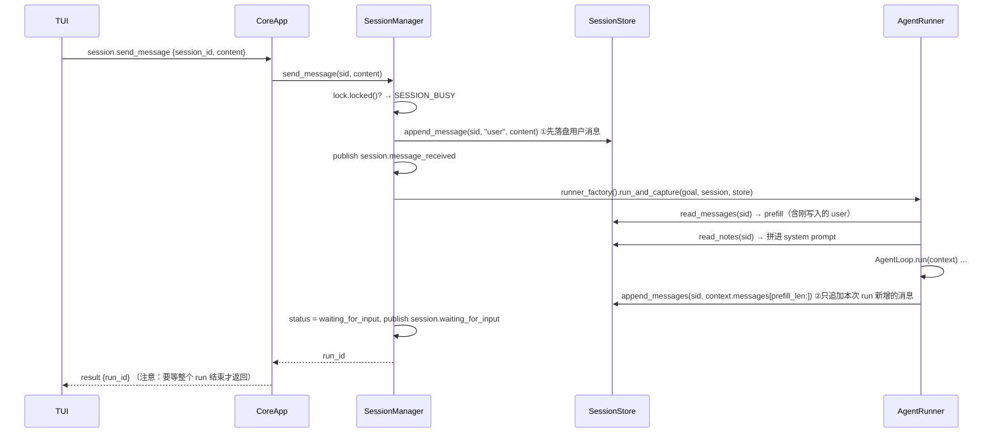

# 06 · S4 会话与记忆

> **阶段目标**：多轮 run 进入同一个 session，thread 和 notes 接住上下文。
> **对应 commit**：`9ffbcc4 feat(s4): 会话与分层语义记忆 + TUI 输入框`（29 文件，+2126 行）
> **本篇涉及文件**：`core/session/model.py`、`core/session/store.py`、`core/session/manager.py`、`core/runner.py`（session 分支）、`core/context.py`（prefill / notes）、`core/tools/builtin/note_save.py`、`core/app.py`（`session.*` handler）、`core/bus/commands.py` / `events.py`、`cli/commands/chat.py`、`tui/app.py`（`ChatTextArea`）

---

## 1. 这一阶段要解决什么问题

S3 为止，每个 run 都是**从零开始**的：`ExecutionContext` 初始化时只有一条 user 消息（goal）。用户说“再帮我把刚才那个函数加上类型注解”，Agent 根本不知道“刚才”是什么。

S4 引入**会话（session）**，把多次 run 串起来，并建立两层记忆：

| 记忆 | 存储 | 内容 | 如何进入模型 |
|------|------|------|-------------|
| **thread**（对话历史） | `thread.jsonl` | 完整的 Anthropic messages（含 tool_use / tool_result） | 作为 `messages` 预填（prefill） |
| **notes**（会话笔记） | `notes.md` | 模型主动用 `note_save` 记下的“持久事实” | 拼进 **system prompt** |

为什么要两层？thread 是“原始录音”，越来越长，迟早要被截断或压缩（S6）；notes 是“笔记本”，只记关键结论（“用户偏好 Python 3.12”“项目用 uv 管理依赖”），短小稳定，放在 system prompt 里永远可见。

同时，前端交互从“一次一个 goal”变成“聊天”：TUI 底部加了输入框，CLI 加了 `kama chat`。

---

## 2. 前置知识

### 2.1 JSONL 追加写与“不可变日志”

`thread.jsonl` 每条消息一行，只追加不修改。好处：崩溃时最多丢最后一行；并发追加天然安全（单进程、单协程写）；可以 `tail` 观察。读的时候逐行解析，**遇到坏行跳过**而不是整体失败（[`store.py:90-94`](../../src/kama_claude/core/session/store.py#L90-L94)）。

### 2.2 asyncio.Lock 的“非阻塞探测”

```python
if lock.locked():
    raise HandlerError(SESSION_BUSY, "session busy")   # 已经有人在用 → 立即拒绝
async with lock:
    ...
```

这不是“等锁”，而是“锁被占用就立即报错”。因为 asyncio 是单线程的，`lock.locked()` 检查和 `async with lock` 获取之间没有 `await`，不会被其他协程插队，所以这个“检查后获取”是安全的。

---

## 3. 设计思路与架构图

### 3.1 Session 状态机

```
            session.create
                  │
                  ▼
              ┌────────┐   send_message (run 结束)    ┌────────────────────┐
              │ active │ ─────────────────────────►  │ waiting_for_input  │
              └────────┘                              └────────────────────┘
                  │                                       │   ▲
                  │ one_shot 模式 run 结束                 │   │ send_message（发布 session.resumed）
                  ▼                                       ▼   │
              ┌────────┐ ◄──────── session.close ─────────┘───┘
              │ closed │
              └────────┘
```

两种模式（[`session/model.py:6-7`](../../src/kama_claude/core/session/model.py#L6-L7)）：

- `chat`：TUI / `kama chat` 用，run 结束后进入 `waiting_for_input`，可以继续发消息。
- `one_shot`：`agent.run`（即 `kama run`）用，run 结束后自动 `closed`。

S4 把 `agent.run` 也改造成“创建 one_shot session + send_message”（[`app.py:97-107`](../../src/kama_claude/core/app.py#L97-L107)）——**所有 run 都走同一条路径**，事件目录、thread 记录、notes 机制对两种入口完全一致。

### 3.2 磁盘布局

```
~/.kama/sessions/sess-3f9a1c2b7d4e/
├── meta.json          {"id","mode","status","title","created_at","updated_at","run_ids":[...]}
├── thread.jsonl       {"ts","role":"user","content":"..."}
│                      {"ts","role":"assistant","content":[...],"run_id":"..."}
├── notes.md           ## Note (2026-06-10T..., run_id)\n用户偏好 Python 3.12\n\n
└── runs/
    ├── 20260610-100000-abc123/events.jsonl  .tasks/
    └── 20260610-100230-def456/events.jsonl  .tasks/
```

### 3.3 一条消息的完整流程



---

## 4. 关键代码精读

### 4.1 SessionStore：[`core/session/store.py`](../../src/kama_claude/core/session/store.py)

纯文件存储，没有任何业务逻辑。几个关键方法：

**`read_messages()`**（[L81-108](../../src/kama_claude/core/session/store.py#L81-L108)）：逐行读 thread.jsonl → 只保留 `role` 和 `content`（丢掉 `ts`、`run_id` 这些 API 不认识的字段）→ `_trim_orphan_tool_use` → `truncate_tool_results`（S6 加入）。

**`_trim_orphan_tool_use()`**（[L111-130](../../src/kama_claude/core/session/store.py#L111-L130)）—— 防御性修复：

```python
pending: set[str] = set()
last_balanced = 0
for idx, msg in enumerate(messages, start=1):
    # assistant 的 tool_use → 加入 pending；user 的 tool_result → 从 pending 移除
    ...
    if not pending:
        last_balanced = idx            # 记录“最后一次完全配平”的位置
if pending:
    return messages[:last_balanced]    # 裁掉尾部未配对的部分
```

什么时候会出现孤儿 tool_use？run 在工具执行中被取消（daemon 关闭、用户中断）时，assistant 的 tool_use 已经写进 thread，但 tool_result 还没来得及产生。下次加载时如果原样发给 API，会得到 400 错误——**整个会话从此无法继续**。这个方法保证 thread 永远可以被安全地重新加载。

**`append_note()`**（[L152-156](../../src/kama_claude/core/session/store.py#L152-L156)）：以 `## Note (时间, run_id)` 为标题追加 Markdown，人也能直接读。

### 4.2 SessionManager：[`core/session/manager.py`](../../src/kama_claude/core/session/manager.py)

**内存索引 + 每会话一把锁**（[L51-52](../../src/kama_claude/core/session/manager.py#L51-L52)）：`_sessions: dict[sid, Session]`、`_locks: dict[sid, asyncio.Lock]`。

**`send_message()`**（[L75-147](../../src/kama_claude/core/session/manager.py#L75-L147)）的主干：

```python
session = self._get_session(sid)                       # 不存在 → SESSION_NOT_FOUND (-32010)
if self._locks[sid].locked():
    raise HandlerError(SESSION_BUSY, "session busy")   # 同一会话正在跑 → -32012
async with lock:
    if session.status == "closed": raise HandlerError(SESSION_CLOSED, ...)   # -32011
    if session.status == "waiting_for_input": publish SessionResumedEvent
    self._store.append_message(sid, "user", content)   # ① 用户消息先落盘
    publish SessionMessageReceivedEvent
    run_id = run_id or new_run_id(); session.run_ids.append(run_id); write_meta
    # （S7 在这里插入了 skill 解析，见 09 篇）
    runner = self._runner_factory()                     # ② 每条消息一个新的 AgentRunner
    await runner.run_and_capture(goal, run_id=run_id, session=session, store=self._store, ...)
    session.status = "closed" if mode == "one_shot" else "waiting_for_input"
    publish SessionClosedEvent / SessionWaitingForInputEvent
    write_meta
```

几个设计点：

- **业务错误码**：`-32010/-32011/-32012` 通过 `HandlerError` 变成结构化的 JSON-RPC 错误，客户端能精确区分“会话不存在”“已关闭”“忙”。
- **`runner_factory`** 是一个“无参工厂函数”（[`app.py:245-251`](../../src/kama_claude/core/app.py#L245-L251) 的 lambda）。SessionManager 不需要知道创建 runner 需要哪些依赖（config、bus、trace、permission、mcp），测试时换成返回 mock runner 的工厂即可（[`test_session_manager.py`](../../tests/unit/test_session_manager.py)）。
- **`session.waiting_for_input` 是“本轮结束”的信号**：TUI 靠它恢复输入框（[`tui/app.py:860-868`](../../src/kama_claude/tui/app.py#L860-L868)），`kama chat` 靠它打印提示。

### 4.3 runner 的 session 分支：[`core/runner.py`](../../src/kama_claude/core/runner.py)

```python
if session is not None and store is not None:           # L154-161
    run_path = store.runs_dir(session.id) / run_id      # run 目录挂到 session 下
    history = store.read_messages(session.id)           # 完整历史（已含本轮 user 消息）
    notes = store.read_notes(session.id)
else:
    run_path = self._runs_dir / run_id
    history = [{"role": "user", "content": goal}]
    notes = ""
...
context = ExecutionContext(..., prefill_messages=history, session_notes=notes, ...)
prefill_len = len(history)                               # L183 记住“预填了多少条”
...（跑 loop）...
if session is not None and store is not None:           # L252-253
    store.append_messages(session.id, context.messages[prefill_len:], run_id=run_id)
```

`prefill_len` 这个技巧很关键：loop 在 `context.messages` 末尾不断追加，run 结束后只需要把 `[prefill_len:]` 这一段（本次 run 新产生的 assistant / tool_result 消息）追加到 thread.jsonl，不会重复写历史。

> 这个“按下标切片”的前提是 `context.messages` 在 run 中**只追加、不替换**。S6 的自动压缩会整体替换 messages，这个前提就被打破了——见 [08 篇思考题](08-s6-context-governance.md#7-思考题)。

**ExecutionContext 的预填**（[`context.py:25-29`](../../src/kama_claude/core/context.py#L25-L29)）：

```python
def __post_init__(self) -> None:
    if self.prefill_messages:
        self.messages = [dict(m) for m in self.prefill_messages]   # 浅拷贝每条消息
    elif not self.messages:
        self.messages.append({"role": "user", "content": self.goal})
```

注意有 prefill 时 **`goal` 不会被追加**——因为 SessionManager 已经把用户消息写进 thread，prefill 里已经包含了。这个细节在 S7 的 skill 机制里会造成一个有趣的后果。

**notes 注入 system prompt**（[`context.py:38-43`](../../src/kama_claude/core/context.py#L38-L43)）：

```python
if self.session_notes.strip():
    parts.append("\n\n## Session Notes\n" + self.session_notes.strip()
                 + "\n\nRemember important durable facts by calling note_save.")
```

末尾那句提示是在“教”模型使用 note_save。

### 4.4 note_save 工具：[`core/tools/builtin/note_save.py`](../../src/kama_claude/core/tools/builtin/note_save.py)

构造时绑定 `(store, session_id, run_id)`，所以只有在 session run 里才注册（[`runner.py:110-113`](../../src/kama_claude/core/runner.py#L110-L113)）。空内容返回错误。TUI 对它做了特殊的“低噪声”展示：成功时摘要只显示 `remembered`（[`tui/app.py:106-107`](../../src/kama_claude/tui/app.py#L106-L107)）。

### 4.5 IPC 命令

[`bus/commands.py`](../../src/kama_claude/core/bus/commands.py) 新增：

| method | 参数 | 结果 | handler |
|--------|------|------|---------|
| `session.create` | `mode`, `title` | `session_id`, `status` | [`app.py:110`](../../src/kama_claude/core/app.py#L110) |
| `session.send_message` | `session_id`, `content` | `run_id`（run 结束后才返回） | [`app.py:117`](../../src/kama_claude/core/app.py#L117) |
| `session.get_history` | `session_id` | `messages` | [`app.py:124`](../../src/kama_claude/core/app.py#L124) |
| `session.close` | `session_id` | `status` | [`app.py:151`](../../src/kama_claude/core/app.py#L151) |

`session.send_message` 与 `agent.run` 的一个重要区别：前者**同步等待 run 完成**才返回。这对“聊天”很自然（发一句、等回复），但会占住一个请求——在 S0 的串行读循环下，同一连接上的其他命令都得排队。S5 审批要解决的正是这个问题。

### 4.6 TUI 输入框：`ChatTextArea`

[`tui/app.py:374-461`](../../src/kama_claude/tui/app.py#L374-L461) 继承 Textual 的 `TextArea`，重写 `_on_key`：

- `Enter` → 发布自定义消息 `ChatTextArea.Submitted`（有内容时）
- `Shift/Alt/Cmd+Enter`、`Ctrl+J` → 插入换行
- 其余按键交回父类（正常编辑）

App 侧 `on_chat_text_area_submitted`（[L614-635](../../src/kama_claude/tui/app.py#L614-L635)）：

```python
self._busy = True
prompt.disabled = True; prompt.border_title = "agent is working..."
self._append(Static(f"[bold]>[/bold] {content}", classes="user-turn"))
self.run_worker(self._do_send_message(content), name="send_message", exclusive=False)
```

**为什么要 `run_worker` 而不是直接 `await self._client.send_command(...)`？** 注释写得很清楚（[L658](../../src/kama_claude/tui/app.py#L658)）：`session.send_message` 要等整个 run 结束才返回，如果在消息 handler 里直接 await，Textual 的消息泵会被阻塞几十秒，期间键盘、焦点、渲染全部卡住。放进 worker，handler 立即返回，UI 保持响应；run 期间的所有渲染都由事件推送驱动。输入框的恢复也不依赖 send_message 返回，而是依赖 `session.waiting_for_input` 事件。

连接建立后 TUI 自动 `session.create {"mode": "chat"}`（[L809-810](../../src/kama_claude/tui/app.py#L809-L810)），退出时 `action_quit` 尽力发送 `session.close`（[L605-611](../../src/kama_claude/tui/app.py#L605-L611)）。

### 4.7 `kama chat`：[`cli/commands/chat.py`](../../src/kama_claude/cli/commands/chat.py)

`input()` 放进线程池（`run_in_executor`），避免阻塞事件循环；`ChatPrinter` 按事件打印。S5 在这里加了审批：有待审批请求时，下一行输入被解释为 `y/a/n/d` 决策（[L97-109](../../src/kama_claude/cli/commands/chat.py#L97-L109)）。

---

## 5. 测试解读

| 文件 | 看点 |
|------|------|
| [`test_session_store.py`](../../tests/unit/test_session_store.py) | meta 往返；读取时剥离 `ts/run_id`；**尾部孤儿 tool_use 被裁掉**；notes 空/追加 |
| [`test_session_manager.py`](../../tests/unit/test_session_manager.py) | 用 mock runner（直接往 thread 写 assistant 消息）验证状态流转：chat → waiting_for_input、one_shot → closed；不存在 / 已关闭的错误码 |
| [`test_runner.py`](../../tests/unit/test_runner.py) `test_session_history_and_notes_injected` | `CapturingProvider` 截获 LLM 入参，断言 messages 来自 thread、system 含 notes、run 目录在 session/runs 下 |
| [`test_runner.py`](../../tests/unit/test_runner.py) `test_session_registers_note_save_tool` | 第一步调 note_save、第二步 end_turn，断言 notes.md 被写入 |
| [`test_note_save_tool.py`](../../tests/unit/test_note_save_tool.py) | 空内容报错 |
| [`test_s4_session_ipc.py`](../../tests/integration/test_s4_session_ipc.py) | 真 daemon：create / get_history / close，**刻意不调 send_message** 以避免依赖真实 LLM |

“Capturing provider”是验证“输入给模型的东西对不对”的标准手法：不关心模型怎么回答，只关心我们喂进去了什么。

```bash
uv run pytest tests/unit/test_session_store.py tests/unit/test_session_manager.py tests/unit/test_runner.py -v
```

---

## 6. 动手练习

1. **观察会话文件**：在 TUI 里聊三轮（第二轮引用第一轮的内容，例如“把刚才那个文件名改成大写”）。然后：
   ```bash
   S=$(ls -t ~/.kama/sessions | head -1)
   cat ~/.kama/sessions/$S/meta.json
   jq -c '{role, run_id, c: (.content|tostring|.[0:60])}' ~/.kama/sessions/$S/thread.jsonl
   ```
   确认 user 消息没有 `run_id`、assistant/tool_result 消息有 `run_id`，想一想为什么。
2. **让模型记笔记**：对它说“记住：我喜欢用 4 个空格缩进，以后写代码都按这个来”，看它是否调用 `note_save`，再看 `notes.md`。新开一轮让它写代码，验证笔记生效。
3. **制造孤儿 tool_use**：让 Agent 执行一个需要审批的 bash 命令，在审批卡片出现时 `kama core stop` 关掉 daemon。重启后……（注意：会话索引在内存里，daemon 重启后旧 session 无法通过 IPC 访问——见思考题 Q1）。改为在 Python 里直接 `SessionStore(...).read_messages(sid)`，验证尾部被裁掉。
4. **SESSION_BUSY**：写一个脚本，对同一个 session 连续发两条 `session.send_message`（第一条还没结束时发第二条），观察第二条收到的错误码。
5. **实现 `session.list`**：新增命令，列出 `~/.kama/sessions/*/meta.json` 的摘要。思考：列出的 session 能继续发消息吗？需要改 SessionManager 的哪部分？

---

## 7. 思考题

**Q1. `SessionManager._sessions` 只在内存里。daemon 重启后会怎样？**

<details><summary>参考答案</summary>

`meta.json` 和 `thread.jsonl` 都还在磁盘上，但 `_sessions` 是空的，任何针对旧 sid 的请求都返回 `SESSION_NOT_FOUND`。TUI 断线重连后也总是 `session.create` 一个新会话，所以“恢复会话”目前不被支持。要支持的话：`_get_session` 找不到时尝试 `store.read_meta(sid)` 懒加载，并为它创建锁；再加一个 `session.resume` / `session.list` 命令让前端选择。
</details>

**Q2. 为什么用户消息在 run **开始前**写入 thread，而 assistant 消息在 run **结束后**批量写入？**

<details><summary>参考答案</summary>

用户消息先写，runner 才能通过 `read_messages` 统一地拿到“包含本轮输入的完整历史”，runner 不需要区分“历史”和“本轮输入”。assistant/tool 消息在结束后批量写，是因为 run 过程中 messages 可能处于“不配平”的中间状态（有 tool_use 还没有 tool_result），批量写能减少这种中间状态落盘的机会。代价是：run 中途 daemon 崩溃，本轮的所有工具调用记录都丢了（events.jsonl 里还有）。如果想要“崩溃也不丢”，可以每步结束时追加，再依赖 `_trim_orphan_tool_use` 在读取时修复。
</details>

**Q3. `SESSION_BUSY` 是“立即拒绝”而不是“排队等待”。两种策略各适合什么场景？**

<details><summary>参考答案</summary>

立即拒绝：交互式场景下，用户在 Agent 工作时又发了一条，最好立刻告诉他“正在忙”，而不是悄悄排队——否则第二条消息执行时的上下文可能已经不是用户以为的样子。排队：批处理场景（脚本连续提交多个任务）更方便。Claude Code 的做法是允许用户在 Agent 工作时输入，作为“插话”在下一步注入上下文，这是第三种策略，需要 loop 支持在步与步之间读取新输入。
</details>

**Q4. TUI 退出时 `action_quit` 会发 `session.close`。如果 Agent 此时正在运行，会发生什么？**

<details><summary>参考答案</summary>

`SessionManager.close` 发现锁被占用，抛 `SESSION_BUSY`，TUI 显示“failed to close session”然后退出。run 本身会继续在 daemon 里跑完（这正是双进程的意义），结束后 session 进入 `waiting_for_input` 并一直留在内存里。如果希望“关 TUI 即取消任务”，需要一个 `session.cancel` 命令去 cancel 对应的 run task；如果希望“任务继续，稍后回来看结果”，就需要 Q1 里说的会话恢复能力。
</details>

**Q5. notes 放 system prompt，thread 放 messages。如果反过来会怎样？**

<details><summary>参考答案</summary>

system prompt 在每次请求中都存在且位置固定，适合“永远有效的背景事实”；并且配合 prompt caching，system 前缀稳定时缓存命中率高（但 notes 一变，system 后面的缓存就失效了——这是一个权衡）。messages 是时间序列，适合“发生了什么”。如果把 notes 放进 messages，它会随着对话变长被“淹没”在中间，也会在压缩/截断时被一起处理掉；如果把完整对话放进 system，就失去了 tool_use/tool_result 的结构，模型无法正确理解工具调用历史。
</details>
