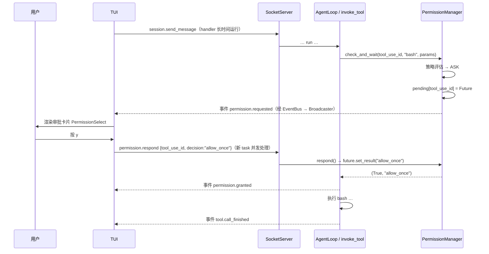

# 07 · S5 工具安全

> **阶段目标**：工具调用前有参数校验、权限审批、失败分类和重试。
> **对应 commit**：`7738b8f feat(s5): 工具执行安全——权限审批 + 失败分类 + 持久化策略`（33 文件，+2270 行）
> **本篇涉及文件**：`core/permissions/*`、`core/tools/invocation.py`、`core/tools/base.py`（`params_model`）、`core/tools/errors.py`、`core/transport/socket_server.py`（并发处理）、`core/app.py`（`permission.respond`）、`core/bus/events.py`（`permission.*`）、`tui/app.py`（审批卡片）、`cli/commands/chat.py`

---

## 1. 这一阶段要解决什么问题

S3 给了 Agent `bash` 和 `write_file`——它现在可以在你的机器上执行任意命令。S5 要在“模型想做”和“真的去做”之间加一道闸门：

```
模型输出 tool_use
   │
   ▼
① 工具存在吗？                 → 否：runtime_error
② 参数合法吗？（pydantic）      → 否：schema_error（不重试）
③ 允许执行吗？（权限）          → 拒绝：permission_denied（不重试）
   │   ├─ 策略直接放行 / 拒绝
   │   └─ 需要问人 → 推事件给前端 → 挂起等待 → 用户决定 / 超时
④ 执行（限时）
   ├─ 成功                        → tool_result
   ├─ timeout                     → 不重试
   └─ runtime_error / rate_limited → 指数退避重试，最多 2 次
```

其中最难的是 ③ 里的“问人”：Agent 在 daemon 里跑，人在 TUI 里；Agent 必须**暂停在工具调用这一行**，等另一个进程里的人按下按键，再从这一行继续。这是整个项目异步编程的精华。

---

## 2. 前置知识

### 2.1 用 Future 实现“跨请求的等待”

```python
# 协程 A（工具调用，在 session.send_message 请求里）
fut = loop.create_future()
pending["toolu_01"] = fut
await emit_event("permission.requested")   # 推给前端
decision = await fut                        # ← 挂起在这里

# 协程 B（另一个请求 permission.respond 的 handler）
pending.pop("toolu_01").set_result("allow_once")   # ← 唤醒 A
```

两个协程通过一个共享的 Future 通信。A 不占用 CPU、不阻塞事件循环，只是“登记了一个回调”。

### 2.2 为什么 S0 的串行读循环会死锁

回忆 S0 的读循环：

```python
while True:
    line = await reader.readline()
    await self._handle_line(line, writer)    # 串行：处理完一条才读下一条
```

TUI 在**同一条连接**上先发了 `session.send_message`，它的 handler 要等整个 run 结束才返回；run 中途需要审批，于是挂起等 `permission.respond`；TUI 发来了 `permission.respond`——但读循环还卡在 `await self._handle_line(send_message)` 上，**根本不会去读下一行**。结果：run 等审批，审批等读循环，读循环等 run——死锁（直到审批超时）。

S5 的修复只有一行（[`socket_server.py:137-139`](../../src/kama_claude/core/transport/socket_server.py#L137-L139)）：

```python
# 每条命令独立作为 task 执行，避免长时间运行的 handler（如 session.send_message）
# 阻塞读循环，使 permission.respond 等并发命令能被及时处理
asyncio.create_task(self._handle_line(line, writer))
```

这样一来，同一连接上的响应可能**乱序**返回（后发的 permission.respond 先响应）。之所以不会乱，是因为 S2 的 `SocketClient` 从一开始就用 `id → Future` 配对响应，而不是假设“按顺序返回”。**好的协议设计让后面的并发化几乎零成本。**

---

## 3. 设计思路与架构图

### 3.1 审批的完整时序



### 3.2 两套分层评估

项目里有两个“评估”函数，要分清：

**静态策略** `policy.evaluate()`（[`policy.py:75-105`](../../src/kama_claude/core/permissions/policy.py#L75-L105)）—— 只看工具名和参数，4 层：

| 层 | 规则 | 结果 |
|----|------|------|
| 1 | bash 命令命中 `deny_patterns` | DENY |
| 2 | bash 命令命中“越出工作目录”启发式 | **强制 ASK** |
| 3 | bash 命令命中 `allow_patterns` | ALLOW |
| 4 | 工具默认策略 | ALLOW / DENY / ASK |

**运行时决策** `PermissionManager.check_and_wait()`（[`manager.py:65-146`](../../src/kama_claude/core/permissions/manager.py#L65-L146)）—— 在静态策略中间插入了两层“记忆”，共 6 层：

| 层 | 规则 | 能被 always 缓存绕过吗 |
|----|------|------------------------|
| 1 | deny_patterns | 否（最高优先） |
| 2 | 越出工作目录 → 直接跳到 ASK | **否**——即使用户选过 always allow bash |
| 3 | 本 session 的 always 缓存 | — |
| 4 | 持久化的 always 缓存（`~/.kama/policy.toml`） | — |
| 5 | allow_patterns | — |
| 6 | 工具默认策略；ASK → 创建 Future 等待 | — |

默认策略表（[`policy.py:40-49`](../../src/kama_claude/core/permissions/policy.py#L40-L49)）：

```python
DEFAULT_POLICIES = {
    "bash":       ASK,     # 有副作用
    "write_file": ASK,     # 有副作用
    "read_file":  ALLOW,   # 只读
    "list_dir":   ALLOW,   # 只读
    "note_save":  ALLOW,   # 只写 session 自己的笔记
}
_UNKNOWN_TOOL_DEFAULT = ASK     # 没登记的工具一律要问
```

---

## 4. 关键代码精读

### 4.1 参数校验：`params_model`

S5 给 `BaseTool` 加了类属性 `params_model: ClassVar[type[BaseModel] | None]`，各工具定义自己的参数模型，例如：

```python
class BashParams(BaseModel):
    model_config = ConfigDict(extra="ignore")               # 模型多传的字段直接忽略
    command: str
    timeout: int = Field(default=60, ge=1, le=120)          # 取值范围约束
```

`invoke_tool` 在权限检查**之前**校验（[`invocation.py:96-103`](../../src/kama_claude/core/tools/invocation.py#L96-L103)）：参数都不合法，就不必打扰用户审批了。校验失败的 `str(exc)` 是 pydantic 的详细错误（哪个字段、什么问题），直接作为 tool_result 返回，模型通常能据此自我修正。

S1 版只检查 `required` 字段是否存在；pydantic 还能检查类型、范围、枚举。

> 注意 `input_schema`（发给模型的 JSON Schema）和 `params_model`（服务端校验）是**手写的两份**，可能不一致（比如 `BashParams` 限制 `le=120`，schema 里只在 description 里用文字说了“max 120”）。可以用 `BashParams.model_json_schema()` 生成 `input_schema` 来消除重复。

### 4.2 越界启发式：[`policy.py:16-30`](../../src/kama_claude/core/permissions/policy.py#L16-L30)

```python
OUTSIDE_CWD_HEURISTICS = [
    r"(^|\s)/[^\s]",              # 绝对路径      cat /etc/passwd
    r"(^|\s)~",                   # 家目录        ls ~
    r"(^|\s)\.\.(/|$|\s)",        # 上级目录      cat ../secret
    r"\$\{?HOME\b",               # $HOME
    r"\$\{?PWD\b",                # $PWD
    r"(^|\s|;|&&|\|\|)cd(\s|$)",  # cd
]
```

名字里的“heuristics（启发式）”很诚实：正则无法完整理解 shell 语义，只能挡住常见写法（见思考题 Q2）。它的定位是“即便用户选了 always allow bash，明显越界的命令也再问一次”的**第二道提醒**，不是沙箱。

### 4.3 挂起与唤醒：[`permissions/manager.py`](../../src/kama_claude/core/permissions/manager.py)

ASK 路径（[L114-146](../../src/kama_claude/core/permissions/manager.py#L114-L146)）：

```python
future = loop.create_future()
self._pending[tool_use_id] = _PendingRequest(future=future, session_id=session_id, tool_name=tool_name)
await event_emitter({... "type": "permission.requested", "param_preview": param_preview(tool_name, params) ...})
try:
    raw = await asyncio.wait_for(future, timeout=self._timeout_s) if self._timeout_s > 0 else await future
except asyncio.TimeoutError:
    self._pending.pop(tool_use_id, None)
    return False, "timeout"                              # 超时视为拒绝
allowed = self._apply_response(raw, session_id, tool_name)
return allowed, raw
```

- **用 `tool_use_id` 作为审批的关联 ID**：它由模型生成、全局唯一，贯穿 `tool.call_started` → `permission.requested` → `permission.respond` → `permission.granted` → `tool.call_finished`，前端据此把所有事件对到同一个工具块上。
- **`event_emitter` 回调**：PermissionManager 不直接依赖 EventBus，而是由调用方（`invoke_tool`）传入一个“怎么发事件”的函数（[`invocation.py:106-107`](../../src/kama_claude/core/tools/invocation.py#L106-L107)），在那里补上 `run_id` 并构造 `PermissionRequestedEvent`。依赖方向更干净，测试时传一个收集列表的函数即可。
- **超时默认 60 秒**（`[permission] timeout_s`、`KAMA_PERMISSION_TIMEOUT_S`，0 表示不超时）。没人响应时 Agent 不会永远卡住，模型会收到“Permission denied by user”并尝试别的办法。

`respond()`（[L149-155](../../src/kama_claude/core/permissions/manager.py#L149-L155)）只做一件事：找到 Future、`set_result`。未知 id（重复点击、超时后迟到的响应）只记警告，不抛异常。

`_apply_response()`（[L158-190](../../src/kama_claude/core/permissions/manager.py#L158-L190)）：`always_allow` / `always_deny` 同时写入 session 缓存和持久缓存，并立即保存 `policy.toml`。

### 4.4 持久化：[`permissions/storage.py`](../../src/kama_claude/core/permissions/storage.py)

```toml
# ~/.kama/policy.toml
# 由 kama-core 自动管理，手动编辑生效但格式须正确

[always]
bash = "allow"
write_file = "deny"
```

读取用了一个手写的迷你解析器（只认 `[always]` 节里的 `key = "value"`），写入是字符串拼接——因为标准库 `tomllib` 只能读不能写，为了不引入依赖就自己写了最小子集。

### 4.5 invoke_tool 的权限与重试：[`tools/invocation.py`](../../src/kama_claude/core/tools/invocation.py)

权限部分（[L105-142](../../src/kama_claude/core/tools/invocation.py#L105-L142)）根据决策发布事件：

| 决策 | 事件 | 说明 |
|------|------|------|
| `auto_allow` | 无 | 静默放行，避免事件噪声 |
| `allow_once` / `always_allow` | `permission.granted` | |
| `auto_deny` | 无（但有 `tool.call_failed`） | |
| `deny_once` / `always_deny` / `timeout` | `permission.denied` | TUI 靠它关闭超时的审批卡片 |

拒绝时返回给模型的文字是精心写的（[L139-140](../../src/kama_claude/core/tools/invocation.py#L139-L140)）：`"Permission denied by user. You may not execute this command. Try an alternative approach or ask the user what to do."`——明确告诉模型“别再试同一个命令了，换办法或者问用户”，否则模型很可能原样重试。

重试部分（[L144-206](../../src/kama_claude/core/tools/invocation.py#L144-L206)）：

```python
_MAX_RETRIES = 2
_RETRY_BASE_S = 2.0
_RETRYABLE = frozenset({"runtime_error", "rate_limited"})

for attempt in range(1, _MAX_RETRIES + 2):          # attempt = 1, 2, 3
    try:
        result = await asyncio.wait_for(tool.invoke(...), timeout=timeout)
        if not result.is_error: publish finished; return result
        error_class = result.error_type or "runtime_error"
    except RateLimitedError: error_class = "rate_limited"
    except TimeoutError:     return await _fail(..., "timeout")      # 超时不重试
    except Exception:        error_class = "runtime_error"
    if error_class in _RETRYABLE and attempt <= _MAX_RETRIES:
        publish ToolCallFailedEvent(attempt=attempt)                  # 每次失败都有事件
        await asyncio.sleep(_RETRY_BASE_S * 2 ** (attempt - 1))       # 2s, 4s
        continue
    return await _fail(..., attempt=attempt)
```

失败分类的设计思路：

| 类别 | 重试？ | 理由 |
|------|--------|------|
| `schema_error` | 否 | 参数错了，重试结果一样，应该让模型改参数 |
| `permission_denied` | 否 | 用户已经明确拒绝 |
| `timeout` | 否 | 再等一遍很可能还是超时，浪费时间 |
| `rate_limited` | 是 | 典型的瞬时错误，等一等就好 |
| `runtime_error` | 是 | 假定是瞬时错误（**但这个假设不总成立**，见思考题 Q3） |

`_RETRY_BASE_S` 是模块级变量，注释写着“tests can monkeypatch to 0”——测试里把退避时间改成 0，重试测试就能瞬间跑完。

### 4.6 TUI 审批卡片

两个组件配合（[`tui/app.py:145-294`](../../src/kama_claude/tui/app.py#L145-L294)）：

- **`PermissionBlock`**：写在日志流里的一行记录，`? permission bash command='rm -rf build'`；决策后变成 `✓ permission ... allowed (once)` 或 `✗ ... denied`。
- **`PermissionSelect`**：可聚焦的选择控件，挂载在**输入框之前**（`self.mount(select, before="#prompt")`，[L718-719](../../src/kama_claude/tui/app.py#L718-L719)），而不是日志滚动区内——注释说明是为了避免 `VerticalScroll` 抢焦点。支持 `↑↓`/`jk` 移动、`Enter` 确认、`y/a/n/d` 或 `1-4` 直接选择。

收到 `permission.requested` 时（[L1005-1026](../../src/kama_claude/tui/app.py#L1005-L1026)）：禁用输入框、追加 PermissionBlock、挂载 PermissionSelect。用户决策后 `PermissionSelect` 发布 `Decided` 消息，App 的 `on_permission_select_decided`（[L678-703](../../src/kama_claude/tui/app.py#L678-L703)）移除选择控件、更新记录、发送 `permission.respond`、恢复输入框。

代码里有大量 `log.debug("... focus ...")` 和一个 App 级 `on_key` 兜底（[L577-602](../../src/kama_claude/tui/app.py#L577-L602)）：如果选择控件因为某种原因没拿到焦点，App 层也能捕获 `y/n` 等按键转发过去。这些痕迹说明作者在“终端 UI 焦点管理”上踩过坑——TUI 开发中这类问题非常常见。

---

## 5. 测试解读

| 文件 | 看点 |
|------|------|
| [`test_permission_policy.py`](../../tests/unit/test_permission_policy.py) | 4 层静态评估的每一层；`/`、`~`、`..`、`$HOME`、`cd` 都触发 ASK；deny 优先于越界；未知工具 ASK |
| [`test_permission_manager.py`](../../tests/unit/test_permission_manager.py) | 后台协程 `respond()` 唤醒等待；always 缓存跨 session 生效；**always allow bash 之后绝对路径命令仍然 ASK**；policy.toml 写入后新实例能加载；超时返回 `(False, "timeout")`；迟到的 respond 不报错 |
| [`test_tool_params.py`](../../tests/unit/test_tool_params.py) | pydantic 参数校验产生 schema_error |
| [`test_tool_retry.py`](../../tests/unit/test_tool_retry.py) | `_FailNTimes(1)` 重试后成功；始终失败时 3 个 failed 事件、attempt 为 1/2/3；schema_error、timeout 不重试 |
| [`test_s5_permission_flow.py`](../../tests/integration/test_s5_permission_flow.py) | 真 loop + 真 PermissionManager：在收到 `permission.requested` 的回调里调用 `respond()`，覆盖 allow_once / deny_once / always_allow 三条路径 |

`test_permission_manager.py` 中验证“等待中被唤醒”的写法值得学习（`test_check_and_wait_ask_emits_event_and_waits`）：

```python
async def _auto_respond() -> None:
    await asyncio.sleep(0)                # 让出一次，让 check_and_wait 先跑到 await future
    mgr.respond("t2", "allow_once")       # 唤醒

task = asyncio.create_task(_auto_respond())
allowed, decision = await mgr.check_and_wait(tool_use_id="t2", tool_name="bash", ...)
await task
```

`asyncio.sleep(0)` 是“主动让出一次控制权”的惯用法，在测试并发时序时非常常用。

另外仓库根目录的 [`trace_permission_flow.py`](../../trace_permission_flow.py) 是一个端到端诊断脚本：用原始 socket 模拟 TUI，触发 bash 审批并自动回复 allow_once，打印全部事件——调试审批链路时很好用。

```bash
uv run pytest tests/unit/test_permission_policy.py tests/unit/test_permission_manager.py tests/unit/test_tool_retry.py tests/integration/test_s5_permission_flow.py -v
```

---

## 6. 动手练习

1. **体验四种决策**：在 TUI 里让 Agent 执行 `echo hello`，分别选 Allow once / Deny / Always allow，观察日志里的记录和 `~/.kama/policy.toml` 的变化。选过 Always allow 后，再让它执行 `cat /etc/hostname`，确认越界命令仍然被询问。（练习完记得删掉 policy.toml 里的条目。）
2. **超时**：`KAMA_PERMISSION_TIMEOUT_S=5 uv run kama-core`，触发审批后不操作，观察卡片变成 `⏱ timed out`，以及模型收到拒绝后的反应。
3. **重现死锁**：把 `socket_server.py:139` 临时改回 `await self._handle_line(line, writer)`，在 TUI 里触发审批并点 Allow——观察 Agent 一直卡到超时。改回来。
4. **可配置的 deny_patterns**：现在 `deny_patterns` / `allow_patterns` 只能在代码里改。给 `config.py` 增加 `[permission.bash] allow_patterns = [...]  deny_patterns = [...]`，在 `CoreApp.run()` 构造 `PermissionManager(policies=...)` 时传入，并为 `rm -rf /` 写一个 deny 测试。
5. **只读工具免审批**：给 `DEFAULT_POLICIES` 加上 `task_list`、`task_get`（ALLOW），思考 `task_create`/`task_update` 应该是什么策略。

---

## 7. 思考题

**Q1. `task_create`、`spawn_agent`、MCP 工具不在 `DEFAULT_POLICIES` 里，会发生什么？这是好是坏？**

<details><summary>参考答案</summary>

它们走 `_UNKNOWN_TOOL_DEFAULT = ASK`：在 `check_and_wait` 里第 6 层 `policy is None`，直接进入 Future 等待。也就是说，模型每创建一个任务、每派生一个子 Agent，都会弹一次审批（除非用户选了 always allow）。安全上这是“默认拒绝”的正确姿势——新接入的工具（尤其是 MCP 这种外部工具）不会被悄悄放行；但对 task_* 这类只操作 Agent 内部状态的工具，会造成明显的“审批疲劳”，而审批疲劳会让用户习惯性地点 always allow，反而削弱安全性。合理做法是为内部工具显式登记 ALLOW，只对外部/有副作用的工具保持 ASK。
</details>

**Q2. 越界启发式能被绕过吗？举例。它应该被当作安全边界吗？**

<details><summary>参考答案</summary>

能。例如 `python -c "open('/etc/passwd').read()"`（路径前面是引号不是空白）、`cat$IFS/etc/passwd`（用 `$IFS` 代替空格）、`echo L2V0Yy9wYXNzd2Q= | base64 -d | xargs cat`，这些都不会命中任何正则。所以它只是“对常见越界写法的额外提醒”，**不是安全边界**。真正的隔离要靠操作系统机制：容器、沙箱（如 macOS sandbox-exec、Linux bubblewrap/landlock/seccomp）、只读挂载等。Claude Code 等产品就是在“权限审批”之外，再用沙箱限制 bash 的文件系统和网络访问。
</details>

**Q3. `runtime_error` 被视为可重试。结合 BashTool 和文件工具的实现，这会导致什么？**

<details><summary>参考答案</summary>

bash 非零退出、read_file 找不到文件、write_file 路径越界、list_dir 目录不存在，都归为 `runtime_error`，都会被重试 2 次（额外等待 2s+4s）。对于“确定性失败”这完全是浪费；对有副作用的 bash 命令（如 `git commit` 在 pre-commit hook 失败后）则可能重复执行。更好的分类：工具自己声明错误是否可重试（`ToolResult` 加 `retryable` 字段），或者只对网络类异常（`ConnectionError`、`RateLimitedError`）重试。另外，审批在重试循环**外面**，所以重试不会再次询问用户——这也意味着用户批准一次，命令可能执行三次。
</details>

**Q4. `PermissionManager.cancel_session()` 有测试，但生产代码里有人调用它吗？客户端断连时，挂起的审批会怎样？**

<details><summary>参考答案</summary>

全仓库搜索只有测试调用它。客户端断连时，SocketServer 只清理了广播订阅，没有通知 PermissionManager，所以挂起的审批只能等到超时（默认 60s）才以 `timeout` 结束；如果配置了 `timeout_s=0`，就会永久挂起，该 session 的锁也一直被占着。修复方式：在连接断开时找出该连接创建/订阅的 session，调用 `cancel_session(sid)`（需要维护“连接 ↔ session”的映射），或者在 TUI 重连后提供“重新推送未决审批”的能力。
</details>

**Q5. always allow 以“工具名”为粒度持久化到全局 `~/.kama/policy.toml`。这个粒度合适吗？**

<details><summary>参考答案</summary>

对 bash 来说粒度太粗：用户在 A 项目里为了方便点了一次 always allow，此后**所有项目、所有会话**的所有 bash 命令都自动放行（只剩越界启发式这道弱防线）。更细的粒度可以是：按命令前缀（`always allow "npm test"`）、按项目目录、按有效期。Claude Code 的做法是按“工具 + 命令模式”记录，并区分项目级和用户级配置。粒度越细越安全，但交互越复杂——这是权限系统设计的永恒权衡。
</details>
