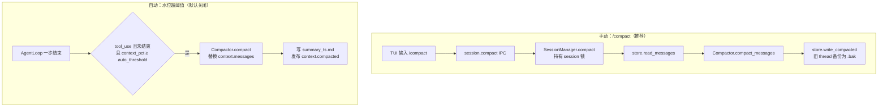

# 08 · S6 上下文治理

> **阶段目标**：长会话下有 context 水位、tool_result 截断和 compact。
> **对应 commit**：`f4567c1 feat(s6): 分层记忆 + 上下文压缩 + 流重试`（23 文件，+882 行）
> **本篇涉及文件**：`core/memory/loader.py`、`core/context.py`（三层 system prompt）、`core/compact/budget.py`、`core/compact/compactor.py`、`core/loop.py`（自动压缩触发）、`core/session/manager.py`（`compact`）、`core/session/store.py`（`write_compacted`、读取时截断）、`core/llm/provider.py`（`context_pct`、流重试）、`core/config.py`（`[compaction]`、项目级 config）、`tui/app.py`（水位条、`/compact`）

---

## 1. 这一阶段要解决什么问题

S4 让会话能“记住”，随之而来的问题是：**会话越长，每次请求发给模型的 messages 越多**。

- 模型的上下文窗口有上限（代码里按 200K token 估算，[`provider.py:16-20`](../../src/kama_claude/core/llm/provider.py#L16-L20)），超了直接报错。
- 即使没超，上下文越长，成本越高、延迟越大，模型对早期内容的注意力也越弱。
- 罪魁祸首往往是**工具输出**：一次 `cat` 大文件、一次冗长的 `pytest` 输出，就是几万字符，而且会在之后的每一步里被重复发送。

S6 从四个方向治理上下文：

| 手段 | 作用时机 | 代价 |
|------|----------|------|
| **可观测**：context 水位 | 每次 LLM 调用后 | 无 |
| **截断**：超长 tool_result 只保留前 4000 字符 | 从 thread 加载历史时 | 丢失旧工具输出的细节 |
| **压缩（compact）**：让 LLM 把整段历史写成结构化摘要 | 手动 `/compact`；或水位超阈值自动触发 | 一次额外 LLM 调用；细节丢失 |
| **分层记忆文件**：全局 / 项目 `context.md` 进 system prompt | 每次 run | 占固定上下文 |

另外还顺带做了一件稳定性工作：**LLM 流式连接断开时自动重试**。

---

## 2. 前置知识

### 2.1 token 与 usage

Anthropic 每次响应都返回 usage：

```jsonc
"usage": {
  "input_tokens": 1520,                  // 本次“未命中缓存”的输入 token
  "cache_creation_input_tokens": 12000,  // 本次写入缓存的 token
  "cache_read_input_tokens": 48000,      // 本次从缓存读取的 token
  "output_tokens": 230
}
```

**注意**：启用 prompt caching 后，`input_tokens` **不是**总输入量，总输入 = `input_tokens + cache_creation_input_tokens + cache_read_input_tokens`。这一点对下面的水位计算很重要。

### 2.2 “摘要交接”式压缩

压缩的思路是：把旧的对话发给模型，让它写一份“交接文档”，然后用这份文档替换掉整段历史。关键在于提示词要让摘要**足够让另一个模型接着干活**——而不是“写一段读后感”。

---

## 3. 设计思路与架构图

### 3.1 system prompt 的分层组装

```
┌─────────────────────────────── system prompt ───────────────────────────────┐
│ base prompt（或 skill / 子 Agent 角色的 override）                            │
│ ## Global Context      ← ~/.kama/context.md      （用户级：个人偏好、通用规则） │
│ ## Project Context     ← ./.kama/context.md      （项目级：项目约定、目录规范） │
│ ## Session Notes       ← sessions/<sid>/notes.md （会话级：本次对话记下的事实） │
│ Remember important durable facts by calling note_save.                       │
└──────────────────────────────────────────────────────────────────────────────┘
```

对应 [`context.py:32-44`](../../src/kama_claude/core/context.py#L32-L44)。这就是 Claude Code 的 `CLAUDE.md`（用户级 / 项目级）+ 对话内记忆的同构设计。仓库自带的 [`.kama/context.md`](../../.kama/context.md) 就是一个例子：要求 Agent 把所有新文件创建在 `./workspace` 下。

### 3.2 压缩的两条路径



配置（[`config.py:52-56`](../../src/kama_claude/core/config.py#L52-L56)）：

```toml
[compaction]
auto_threshold = 0.0      # 0 = 关闭自动压缩（默认），推荐手动 /compact
tool_result_limit = 8000
tool_result_keep = 4000
```

---

## 4. 关键代码精读

### 4.1 水位：从 usage 到进度条

provider 计算（[`provider.py:125-140`](../../src/kama_claude/core/llm/provider.py#L125-L140)）：

```python
context_pct = usage.input_tokens / _context_window(self._model)
await bus.publish(LlmUsageEvent(..., context_pct=context_pct, ...))
```

TUI 渲染（[`tui/app.py:729-739`](../../src/kama_claude/tui/app.py#L729-L739)）：

```python
def _render_ctx_bar(self, pct):
    filled = int(pct * 20)
    bar = "█" * filled + "░" * (20 - filled)
    color = "bold red" if pct >= 0.85 else ("yellow" if pct >= 0.70 else "dim")
    return f"[{color}]ctx:{pct * 100:.1f}% {bar}[/{color}]"
```

每次 `llm.usage` 事件都会在日志流里追加一行 `tokens in=… out=… cache=…  ctx:12.3% ██░░░…`，颜色随水位变黄、变红，提醒用户该 `/compact` 了。（子 Agent 的 usage 不显示，避免混淆主会话水位，[L979-982](../../src/kama_claude/tui/app.py#L979-L982)。）

> 这里有一个值得注意的问题：分子只用了 `input_tokens`。按 2.1 节，开启 prompt caching 后（本项目每次请求都开），大部分输入会计入 `cache_read_input_tokens`，于是 `context_pct` 会**明显偏低**——真实水位可能已经很高，进度条却显示很低。见思考题 Q1。

### 4.2 截断：[`compact/budget.py`](../../src/kama_claude/core/compact/budget.py)

```python
def truncate_tool_results(messages, limit=8_000, keep=4_000):
    for msg in messages:
        if msg["role"] != "user" or not isinstance(msg["content"], list): 原样保留
        for block in msg["content"]:
            if block["type"] == "tool_result" and isinstance(block["content"], str) and len(...) > limit:
                block = dict(block)                                  # 复制，不改原对象
                block["content"] = text[:keep] + f"\n[... {omitted} chars omitted. Full output in run events.]"
```

- 只截 `tool_result`，不动用户文本和 assistant 输出——那些是对话的“骨架”，而工具输出是“证据”，旧证据看个开头通常就够了。
- 截断提示语告诉模型“完整内容在 run events 里”——它是真的：`tool.call_finished` 事件的 `output` 字段保存了完整输出。
- 调用点在 [`store.py:107-108`](../../src/kama_claude/core/session/store.py#L107-L108)：**只在从 thread 加载历史时截断**，`thread.jsonl` 里保存的仍是原文。当前 run 内产生的工具输出不截断（本轮模型需要完整信息）。
- `limit`/`keep` 有对应的配置项，但调用处用的是模块常量默认值，配置并没有接进来（思考题 Q4）。

### 4.3 压缩器：[`compact/compactor.py`](../../src/kama_claude/core/compact/compactor.py)

**提示词**（[L18-45](../../src/kama_claude/core/compact/compactor.py#L18-L45)）要求固定六节：

1. Original Goal（原始目标，一句话）
2. Completed Steps（已完成步骤：具体到文件路径、命令、决策）
3. Key Constraints & Discoveries（过程中发现的约束）
4. Current File State（每个被改过的文件现在的状态）
5. Remaining TODOs（剩余待办，有序）
6. Critical Data（必须原样保留的值：ID、错误信息、配置值）

并强调 “Another LLM instance will continue this task from your summary alone” 和 “Omit reasoning steps and intermediate attempts. Keep conclusions.”——这份提示词本身就是一个很好的“交接文档模板”，值得收藏。

**`compact_messages()`**（[L105-151](../../src/kama_claude/core/compact/compactor.py#L105-L151)）是纯函数式的核心：

```python
original_estimate = sum(len(str(m["content"])) for m in messages) // 4      # 粗略：4 字符 ≈ 1 token
history_text = _messages_to_text(messages)       # 把结构化消息拍平成 [USER]/[ASSISTANT]/<tool_call>/<tool_result> 文本
silent_bus = EventBus()                          # ← 用一个没人订阅的 bus
response = await provider.chat(
    messages=[{"role": "user", "content": f"{prompt}\n\n---\n\n{history_text}"}],
    tool_schemas=[],                             # 不给工具，模型只能输出文本
    bus=silent_bus, run_id="compact", ...)
```

两个细节：

- **为什么要拍平成文本？** 如果原样把 messages 发过去，模型会以为“自己就在这段对话里”，可能接着干活而不是写摘要。拍平后，历史变成了“一份需要总结的材料”。
- **为什么用 silent_bus？** provider 会发布 `llm.token` 事件。如果用主 bus，TUI 会把摘要的生成过程当作 Agent 的回复流式显示出来。

失败（异常或空摘要）时返回 `None`，调用方保持原样——**压缩是优化，失败不能破坏会话**（测试 `test_compact_failure_preserves_context`）。

**`compact()`**（[L73-102](../../src/kama_claude/core/compact/compactor.py#L73-L102)）用于 run 内自动压缩：

```python
context.messages = [
    {"role": "user", "content": result.summary_text},
    {"role": "assistant", "content": "Understood, I'll continue from this summary."},
]
self._write_summary(result.summary_text)          # summary_<ts>.md
await self._bus.publish(ContextCompactedEvent(...))
```

### 4.4 自动压缩的触发时机：[`loop.py:118-128`](../../src/kama_claude/core/loop.py#L118-L128)

```python
if (not context.is_done()
        and response.stop_reason == "tool_use"
        and self._compactor is not None
        and self._compact_threshold > 0
        and response.usage is not None
        and response.usage.context_pct >= self._compact_threshold):
    await self._compactor.compact(context, self._provider)
```

为什么只在“tool_use 且工具结果已追加完”时压缩？注释说：此时 messages 末尾是 user（工具结果），整段历史是配平的，压缩不会切断一对 tool_use / tool_result。如果在 end_turn 时压缩就没有意义（run 已结束）。

### 4.5 手动压缩：`session.compact`

[`SessionManager.compact()`](../../src/kama_claude/core/session/manager.py#L162-L185)：

1. 检查 session 锁：Agent 正在跑时返回 `SESSION_BUSY`（不能边跑边改 thread）。
2. `read_messages` → `compact_messages` → 失败抛 `HandlerError(-32021)`。
3. `store.write_compacted()`（[`store.py:133-142`](../../src/kama_claude/core/session/store.py#L133-L142)）：**先把旧 thread.jsonl 重命名为 `thread_<ts>.jsonl.bak`**，再写入 `[summary, ack]` 两条消息。破坏性操作前先备份，是处理用户数据的基本素养。
4. 返回 `summary_tokens` 和 `saved_tokens`（估算值）。

用的 provider 是 CoreApp 启动时创建的 `compact_provider`（[`app.py:236`](../../src/kama_claude/core/app.py#L236)）——这就是 daemon 启动必须有 API key 的原因。

TUI 侧：输入框提交时特判 `/compact`（[`tui/app.py:619-623`](../../src/kama_claude/tui/app.py#L619-L623)），在 worker 里调用 IPC，完成后显示 `⚡ Context compacted summary=… saved≈…` 并把水位归零。S7 的斜杠补全菜单里 `compact` 是第一个内建项。

### 4.6 流式重试：[`provider.py:98-121`](../../src/kama_claude/core/llm/provider.py#L98-L121)

```python
for attempt in range(1, 4):
    text_parts = []                                         # 每次重试清空
    try:
        async with self._client.messages.stream(**kwargs) as stream:
            async for text in stream.text_stream:
                if attempt == 1:                            # 只在第一次尝试时发布 token 事件
                    await bus.publish(LlmTokenEvent(...))
                text_parts.append(text)
            final_message = await stream.get_final_message()
        break
    except (httpx.RemoteProtocolError, httpx.ReadError, httpx.ConnectError) as exc:
        if attempt == 3: raise
        await asyncio.sleep((1.0, 2.0, 4.0)[attempt - 1])
```

只重试**连接层错误**（对端断开、读失败、连不上），不重试 API 返回的 4xx/5xx（那些由 SDK 自己的重试机制处理，或者是请求本身有问题）。“只在第一次发布 token”是为了避免 TUI 上同一段文字出现两遍——但也带来了新问题（思考题 Q3）。

### 4.7 项目级配置

S6 让 `get_config()` 在 `~/.kama/config.toml` 之后再叠加 `./.kama/config.toml`（[`config.py:99-103`](../../src/kama_claude/core/config.py#L99-L103)），与 context.md 的“全局 → 项目”分层保持一致。

---

## 5. 测试解读

| 文件 | 看点 |
|------|------|
| [`test_budget.py`](../../tests/unit/test_budget.py) | 边界值：7999 / 8000 不截断、10000 截断；text block 和 assistant 消息不受影响；同一消息多个 tool_result 独立判断 |
| [`test_compactor.py`](../../tests/unit/test_compactor.py) | `MagicMock` + `AsyncMock` 做 provider；断言 `tool_schemas=[]`、messages 被替换成两条、写了 summary 文件、发布了事件、失败时原样保留。**注意**：这组测试是同步函数里 `asyncio.get_event_loop().run_until_complete(...)`，在 Python 3.12 + pytest-asyncio 下会报 “There is no current event loop”——改成 `async def` 测试即可 |
| [`test_context_system_prompt.py`](../../tests/unit/test_context_system_prompt.py) | 三层都有时顺序正确；都没有时只有 base；只有 notes 时包含 note_save 提示 |
| [`test_memory_loader.py`](../../tests/unit/test_memory_loader.py) | 文件不存在返回空串 |

```bash
uv run pytest tests/unit/test_budget.py tests/unit/test_context_system_prompt.py tests/unit/test_memory_loader.py -v
uv run pytest tests/unit/test_compactor.py -v     # 观察那 6 个失败，然后试着修复（练习 5）
```

---

## 6. 动手练习

1. **三层记忆**：写 `~/.kama/context.md`（“回答时使用中文”）和 `./.kama/context.md`（“新文件放在 workspace/ 下”）。用 `kama trace --raw --layer llm | jq -r 'select(.kind=="api_call") | .data.system' | tail -1` 查看最终的 system prompt。
2. **观察水位与截断**：让 Agent 执行几次输出很长的命令（如 `find / -maxdepth 3 2>/dev/null`），观察 ctx 条的变化。下一轮消息时，用 trace 查看历史里的 tool_result 是否带上了 `[... N chars omitted ...]`。
3. **手动压缩**：聊几轮后输入 `/compact`。然后查看 session 目录下的 `thread.jsonl`（只剩两行）、`thread_*.jsonl.bak`（原始历史）。再问一个关于早期对话的细节，看模型能否从摘要里回答。
4. **打开自动压缩**：`KAMA_COMPACT_THRESHOLD=0.05 uv run kama-core`（阈值故意设得很低），给一个多步任务，观察 `context.compacted` 事件和 `summary_*.md`。任务结束后查看 thread.jsonl——本轮的工具调用记录是否被写进去了？（带着这个观察去看思考题 Q2。）
5. **修测试**：把 `test_compactor.py` 里的同步测试改成 `async def` + `await`，让它们在 3.12 下通过。
6. **把配置接上**：让 `tool_result_limit` / `tool_result_keep` 配置真正生效（提示：`SessionStore` 需要拿到这两个值）。

---

## 7. 思考题

**Q1. `context_pct = usage.input_tokens / window`，在启用 prompt caching 的情况下准确吗？应该怎么算？**

<details><summary>参考答案</summary>

不准确，会偏低。Anthropic 的 `input_tokens` 只是“缓存断点之后、未命中缓存的输入”，被缓存的部分记在 `cache_read_input_tokens` / `cache_creation_input_tokens` 里。本项目每次请求都给 system 和 tools 加了缓存断点，长会话里大部分前缀都来自缓存，于是 `input_tokens` 可能只有几千，而真实上下文已经十几万。应改为 `(input_tokens + cache_read_input_tokens + cache_creation_input_tokens) / window`。这个偏差还会直接影响自动压缩：阈值永远达不到，自动压缩永远不会触发。
</details>

**Q2. 在 session 模式下，如果 run 中途发生了自动压缩，runner 结束时 `store.append_messages(session.id, context.messages[prefill_len:])` 会写入什么？**

<details><summary>参考答案</summary>

压缩后 `context.messages` 被替换成只有 2 条（加上压缩后新产生的几条）。而 `prefill_len` 是压缩前历史的长度（比如 40）。`messages[40:]` 很可能是空列表——**本轮 run 的所有 assistant 输出和工具记录都不会写进 thread.jsonl**；同时 thread.jsonl 仍然保留完整的旧历史，下一轮又会加载全部旧内容（压缩在持久层等于没发生，只留下一个 summary 文件）。修复思路：compactor 在替换 messages 时同时通知 runner（例如在 context 上记录 `compacted=True` 和新的基线下标），runner 结束时若发生过压缩，就用 `write_compacted` 写入“摘要 + 压缩后新增的消息”，而不是切片追加。这也解释了为什么默认关闭自动压缩、推荐手动 `/compact`。
</details>

**Q3. 流式重试时“只在第一次尝试发布 token 事件”，会带来什么用户可见的问题？**

<details><summary>参考答案</summary>

如果第一次尝试流到一半断开，TUI 已经显示了半截文本；第二次尝试成功后，模型生成的内容可能和第一次完全不同，但 TUI 上不会有任何新 token，用户看到的仍是那半截旧文本。而 `LlmResponse.text`、写入 thread 的内容是第二次的完整文本——**界面与实际历史不一致**。更好的做法：重试前发布一个“流重置”事件（比如 `llm.stream_reset`），TUI 收到后清空当前 LLMStreamBlock，然后照常发布新一轮的 token。
</details>

**Q4. 配置里有 `tool_result_limit` / `tool_result_keep`，为什么改了不生效？这类问题怎么预防？**

<details><summary>参考答案</summary>

`get_config()` 正确解析并校验了这两个值，但 `SessionStore.read_messages()` 调用 `truncate_tool_results(messages)` 时用的是函数默认参数（模块常量 8000/4000），配置对象根本没有传到这里。预防方法：① 为每个配置项写一个“端到端生效”的测试（改配置 → 断言行为变化）；② 避免“配置对象”和“模块常量”并存两套默认值；③ 代码审查时对新增配置项搜索其使用点（`grep tool_result_limit` 只在 config.py 里出现，就说明没接上）。
</details>

**Q5. 压缩后 messages 以 `assistant: "Understood, I'll continue from this summary."` 结尾。对“run 内自动压缩”来说，下一次 LLM 请求会是什么样子？**

<details><summary>参考答案</summary>

自动压缩发生在 run 继续的时候，下一步直接用这两条消息调用模型，最后一条是 assistant。在 Anthropic API 中，以 assistant 结尾的请求表示“预填充（prefill）”，模型会接着这句 “Understood, I'll continue…” 往下写。一般能工作，但有几个隐患：部分模型/模式（如开启 extended thinking）不允许 assistant 预填充；并且上一步的工具结果只以摘要形式存在，模型需要从摘要里“回忆”自己刚做到哪。一个更稳妥的做法是在压缩结果末尾再追加一条 user 消息，例如“请根据以上摘要继续完成剩余 TODO”，让对话以 user 结尾。
</details>
